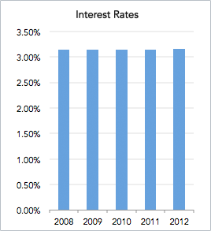
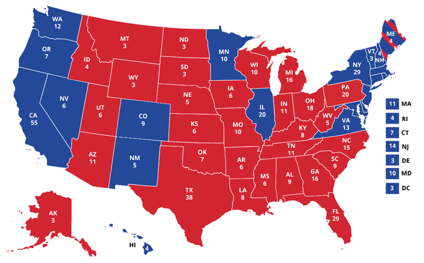
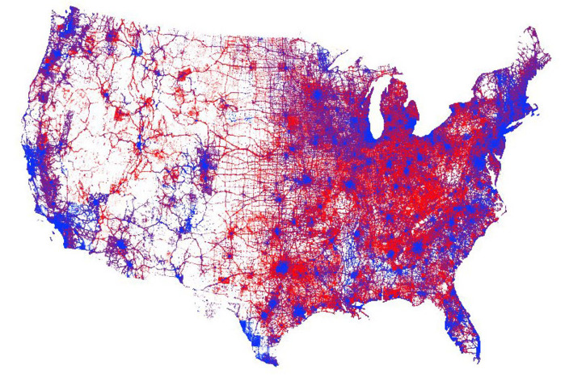
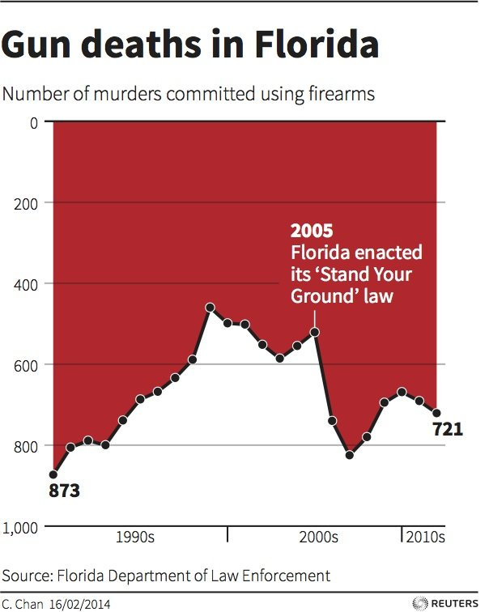

# Bias

## Learning Objectives

* SWBAT examine the ways in which data can be misused in presentation and analysis.
* SWBAT critique the intentional misuse of data.
* SWBAT recognize the unintentional misuse of data.

## Sequence

1. [Launch](#launch)
2. [Case Study 1: Bias in Reporting](#case-study-1-bias-in-reporting)
3. [Case Study 2: Bias in Interpretation](#case-study-2-bias-in-interpretation)
4. [Case Study 3: Bias in Visualization](#case-study-3-bias-in-visualization)
5. [Close](#close)

## Launch

Consider the following Facebok post and excerpt from a [news article in the _Tennessean_ newspaper](https://www.tennessean.com/story/news/2017/07/20/tennessees-unemployment-rate-last-month-lowest-state-history-gov-bill-haslam-announced-thursday/496383001/) from 2017:

| Facebook Post |
| --- |
| <h3>Tennessee continues to be a great place to do business, and I am proud of all our state has done to create an environment for job growth.</h3><h5>--Sen. Bob Corker, TN</h5> |

| Tennessean Excerpt |
| --- |
| <h3>Haslam: June featured lowest unemployment rate in Tennessee history</h3><h5>Tennessee's unemployment rate last month was the lowest in state history, Gov. Bill Haslam announced Thursday.</h5>
<h5>The state had a preliminary seasonally adjusted unemployment rate of 3.6 percent in June.</h5><h5>[...]</h5><h5>Haslam said the unemployment figures came after decisions made by his administration and the state legislature. "We honestly think this is a result of the policies put in place by the state of Tennessee and the General Assembly," he said.</h5><h5>The state's previous low for unemployment rate was 3.7 percent in March 2000.</h5> |

#### Discussion Questions

- How would you describe each author's intent for writing their post/artcile?
- How is each author using their language to impact the reader's response?
- What data is each author including or not including that might impact the reader's response?
- What other data might be relevant for making a decision whether or not the post and excerpt are meaningful?

Now consider the following chart that shows the percent of each state's workers who are paid at or below minimum wage:

- Where does Tennessee rank on the list?
- Does this data support Sen. Corker's assertion that "Tennessee continues to be a great place to do business" and that Tennessee has "create[d] an environment for job growth"? Do you think it's a great place for workers to work?
- How does this data complicate the _Tennessean_'s conclusions about the state's unemployment rate?

One conclusion might be that even though the state's unemployment rate is lower than it has been (but what is it compared to other states?), you still can't get anywhere working in Tennessee since so many jobs are at or below minimum wage.

This is an example of selection bias: the senator and the newspaper each had a story they wanted to tell and chose data that supports the point the want to make. In this case, that point may just be "Tennessee is a great place for jobs!"

#### Additional Reading

- Based on this [Quora discussion about political spin](https://www.quora.com/Whats-an-example-of-a-misleading-political-spin).

## Types of Bias in Data Science

*Bias* means believing what you want to believe and refusing to take into consideration the opinions of others. In data science, bias can manifest in a few ways:

1. *Confirmation bias* is when you want to prove a pre-determined conclusion.
2. *Selection bias* is when you subjectively use data that supports the point you want to make.
3. *Outliers* - if a dataset has extreme outliers, average values can be skewed.
4. *Overfitting (and underfitting)* can lead to an overly-complicated (or overly-simplistic) model to represent the data.
5. *Confounding variables* is when there's something missing from the dataset that influences both the independent and dependent variables, but which causes you to assume a cause-and-effect relationship.
6. *Correlation is not causation.* Just because two things follow the same trend doesn't necessarily mean one causes the other.
	1. Can also show [Spurious Correlations](https://www.tylervigen.com/spurious-correlations).

## Case Study 1: Bias in Reporting

The following two headlines and subheads were written by two different news outlets about a 2018 shooting death in Dallas, TX.

| Headline A |
| --- |
| <h3>Police officer charged in shooting death of unarmed neighbor</h3><h5>Dallas police officer Amber Guyger says she entered Botham Shem Jean's apartment by mistake at end of her shift; Casey Stegall reports.</h5> |

| Headline B |
| --- |
| <h3>Dallas police officer charged with manslaughter in fatal shooting of unarmed man in his own apartment</h3><h5>A Dallas police officer was arrested Sunday in connection with the shooting death of Botham Shem Jean, the Texas Rangers said.</h5><h5>Amber Guyger, who is white, was off-duty when she shot Jean, a black man, after mistakenly entering his apartment at the complex where she also lived, police said Thursday.</h5> |

#### Discussion Questions

- How would you describe each author's intent for writing their headline and subhead?
- How is each author using their language to impact the reader's response?
- What data is each author including or not including that might impact the reader's response?
- JOLSON TO ADD GUIDING QUESTION(S)

The comparison you've just made is what people think about when they think about biased reporting. Unfortunately, the biases with which we analyze data can also lead to differences in interpretation.

## Case Study 2: Bias in Interpretation

When we interpret data, we can "spin" data in quite a few ways:
> Many people will be familiar with the concept of "spin"; in popular culture, spin is "a form of propaganda to influence public opinion" (Esquire 1996;126:70), more specifically "the manipulation of language to convince the reader of the likely truth of the result." (BMJ 1995;310:985–7)

1. *Confirmation bias* (mentioned above) is evaluating evidence that supports one's preconceptions differently from evidence that challenges these convictions.
2. *Rescue bias* is discounting data by finding selective faults in the experiment.
3. *Auxiliary hypothesis bias* is introducing ad hoc modifications to imply that an unanticipated finding would have been otherwise had the experimental conditions been different.
4. *Mechanism bias* is being less skeptical when underlying science furnishes credibility for the data.
5. *"Time will tell" bias* is the phenomenon that different scientists need different amounts of confirmatory evidence.
6. *Orientation bias* is the possibility that the hypothesis itself introduces prejudices and errors and becomes a determinate of experimental outcomes.

The following [two passages](https://www.business2community.com/government-politics/celebrating-2016-elections-history-political-spin-01672605) about the same person are examples of a type of political spin. Each is selective about how it frames the story in order to achieve its intended outcome.

| Passage A |
| --- |
| <h5>His great-great uncle was hanged for horse stealing and train robbery in the late 1880s. He was first captured as a horse thief, but then he escaped incarceration and went on to rob trains. He was eventually re-captured and was ultimately put to death by hanging.</h5> |

| Passage B |
| --- |
| <h5>His great-great uncle was a famous cowboy in the Montana Territory. His business empire grew to include acquisition of valuable equestrian assets and intimate dealings with the Montana railroad. Beginning in 1883, he devoted several years of his life to government service, finally taking leave to resume his dealings with the railroad. In 1887, he was a key player in a vital investigation. In 1889, he passed away during an important civic function held in his honor when the platform upon which he was standing collapsed.</h5> |

#### Discussion Questions

- How do the authors' interpretations of the historical record differ?
- What would each author want the reader to think about the subject's great-great uncle?
- How does each author use data and information to guide the reader's opinion of the subject's great-great uncle?
- JOLSON TO ADD GUIDING QUESTION(S)

Sometimes people interpret data differently, and that can be ok. However, if those interpretations don't also recognize the effects of inherent biases, the reader is required to make a critique of the biases which might be affecting how an author has come to their conclusions.

## Case Study 3: Bias in Visualization

Consider the three sets of data visualizations below. Each pair represents the same information:

| Visualization A | Visualization B |
| :---: | :---: |
|  |  |

| Visualization A | Visualization B |
| :---: | :---: |
|  |  |

| Visualization A | Visualization B |
| :---: | :---: |
|  |  |

#### Discussion Questions

- Why did the person making each of these graphs choose to represent the data the way they have?
- What message do you think that person was trying to communicate by making those choices?
- Which do you think is more biased? more unbiased?
- JOLSON TO ADD GUIDING QUESTION(S)

## Close

Bias is complicated. It can be intentional or unintentional; it can be hidden or it can be overt. Bias is usually dangerous and harmful, but it can be incredibly difficult to get away from our own biases. Bias can be a weapon to accomplish specific ends, and bias can cause us to think narrowly.

- What are your biases?
- How can you ensure that your biases don't affect your interpretation of data?
- JOLSON TO ADD GUIDING QUESTION(S)
