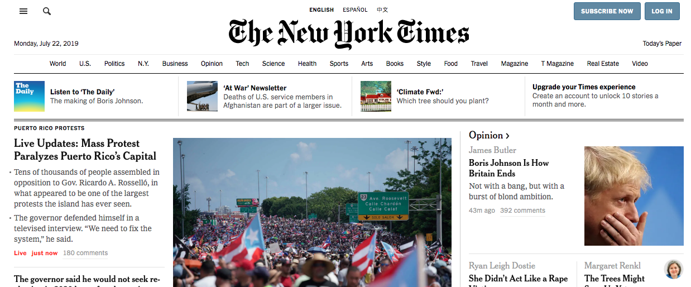

# Collecting Data: 2 Day Lab

## About

In this lab, you'll design your own data collection _instrument_ and you'll use it to collect your own data.

## Day 1: Instrument Design

### Choose a topic

In groups of 4-6 students, head to [The New York Times Homepage](https://nytimes.com). Look through the front page and select an issue that people in the group disagree about. It doesn't have to be political (although it can be), but could be something in entertainment ("Disney's live-action remakes are so much better than the cartoons."), sports ("The US Women's National Soccer Team should be paid more than the US Men's National Soccer Team."), or even NYC culture ("Con Edison should refund customers' monthly bills any time the electricity goes out.").

Come up with a statement that the group wants to study, and be as specific as you can: "It should be illegal for the government to track protesters based on social media." is better than "Social media and protesting."

### Brainstorm questions

- Write one question about the topic per post-it note. Try to think of a range of questions:
	- some that could be answered with `Yes`/`No`/`Maybe` (e.g. "Do you use social media?")
	- some that could be answered numerically (e.g. "How many times a week do you post?")
	- some that could start "On a scale of 0 to 10..." (e.g. "On a scale of 0 to 10, how important is social media in your life?")
	- some that could be answered with a list of responses (e.g. "What social media platforms do you use?")
	- some that could be answered categorically (e.g. "Which social media platform do you use the most?")
- Keep writing questions until you have a bank of 15-20 questions as a group.
- Consolidate any duplicate questions, and then arrange the questions in order of increasing complexity. Choose no more than 10 question that will go into your data collection instrument; try to have a variety of question types.
- > Note: Additionally, include demographics questions that may be helpful when you try to make sense of your data: e.g. age, location, gender, etc. Be as specific as you can.

### Build the instrument

- Use [Google Forms](https://docs.google.com/forms) or [Typeform](https://www.typeform.com/) to build out the survey instrument. Input the questions and answers, then make sure the form is live so any respondent who has the link could fill it out.
- Make sure to test the link before you send it out. It should record the answers that are submitted.

### Collect responses

- **Each group of two should try to get at least 10 responses to the survey.**
	- One group of two is responsible for collecting data **electronically**. This group should post the survey to facebook/instagram/twitter (whatever you choose) and/or email the survey for people to fill out. Make sure the form is storing the responses after people fill it out.
	- The other group(s) are responsible for collecting data **in person**. These groups should take their list of questions and ask people (in person) to respond. In-person data collection teams should divide responsibilities into (a) a question-asker and (b) an answer-recorder. Make sure to capture the responses people tell you.

## Day 2: Data Aggregation and Interpretation

### Data Aggregation

- As a group, create a shared Google Sheet where you can aggregate the data that was collected.
- > Make a note of which data was collected electronically and which data was collected in-person.
- Share the Google Sheet with everyone in the group. Each team member should make a copy of the aggregate data in order to be able to work with it.

### Clustering

- Cluster the responses you gathered by similarity. What criteria can you use to consider responses/respondents similar (or dissimilar)?
- Give each cluster a name that describes how the responses/respondents are similar.
- Explore each cluster to see where the responses are not cohesive. What does that say about the cluster?
- Compare the clusters you have made. What is the same and what is different between clusters?

> Note: There is no right or wrong way to do this.

### Drawing Conclusions

- What conclusions can you draw based on the answers you gathered to the questions you asked?
- How would you revise any of the questions you asked to improve the data you collected?
- What additional questions would you want to ask that you now feel like were missing?

