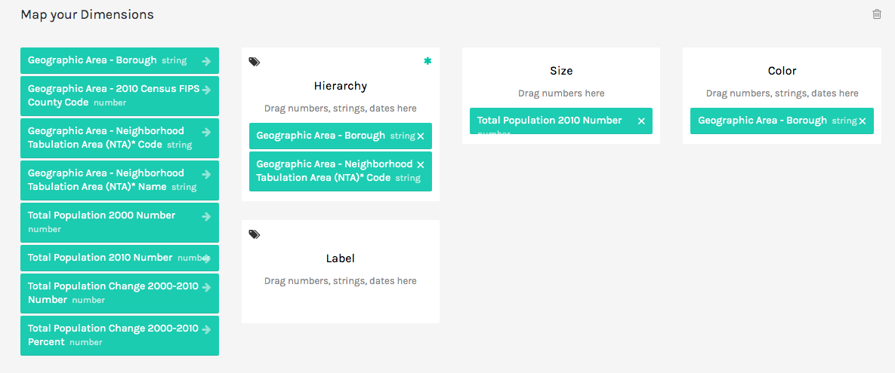

# NYC Census Data by Neighborhood


> 3D map of NYC property values by neighborhood from [neighborhoodx.com](https://neighborhoodx.com)

It's 20 minutes before a big meeting with City Hall, and your manager asks you to quickly make sense of the city's most recent census data. How can you quickly explore a dataset to get a sense of it?

## Google Sheets

- Make a copy of the [Census Demographics at the Neighborhood Tabulation Area (NTA) level](https://docs.google.com/spreadsheets/d/1VyYiY63blaLIyLAXIzk114vkCYPv0zMg8Lh33_2kldM/edit?usp=sharing)

> Note: this data is also available [from the NYC Open Data Portal](https://data.cityofnewyork.us/City-Government/Census-Demographics-at-the-Neighborhood-Tabulation/rnsn-acs2)

1. Scroll down through the dataset: what trends and patterns can you see? Does any data not belong?


2. Tap the "Explore" button in the bottom-right corner of Google Sheets. Then next to "Analysis", tap "More". Do any of the graphs have useful insights to share with your manager?
3. What do the peaks represent in the graph of "Total Population Change 2000-2010 Percent vs. Geographic Area - Neighborhood Tabulation Area"?
4. Explore the Chart feature of Google Sheets to try to generate a meaningful exploratory data visualization.

## app.rawgraphs.io

5. Export the Google Sheet as a CSV file (or download the raw data from [Open Data NYC](https://data.cityofnewyork.us/City-Government/Census-Demographics-at-the-Neighborhood-Tabulation/rnsn-acs2)). Then upload the file to [app.rawgraphs.io](http://app.rawgraphs.io/).
> Note: if you haven't already, delete the last two lines of commentary:
> ```
> "*Neighborhood Tabulation Areas, or NTAs, are aggregations of census tracts that are subsets of New York City's 55 Public Use Microdata Areas (PUMAs). ",,,,,,,
> "Primarily due to these constraints, NTA boundaries and their associated names may not definitively represent neighborhoods.",,,,,,,
> ```
6. Scroll down and choose the Circle Packing plot. Then scroll down and drag-and-drop the following fields in the following locations:
	1. Hierarchy: `Geographic Area - Neighborhood Tabulation Area (NTA)* Code`
	2. Size: `Total Population 2010 Number`
	3. Color: `Geographic Area - Borough`
	4. Label: 
	5. You can also choose "Sort By Size" to arrange all circles by size.


7. Drag-and-drop the `Geographic Area - Borough` tab as the first box under Hierarchy.


8. Choose a better label for each bubble, e.g. neighborhood name.
9. Using similar parameters, explore the Treemap visualization. Try to make something that looks like this:

10. Use the Sunburst chart to emphasize areas of the five boroughs where the population has grown significantly from 2000 to 2010. If you had more time, how might you clean the data to make the chart more visually appealing?
11. Use the Scatter Plot to emphasize neighborhoods where the population has grown significantly from 2000 to 2010. What outliers do you notice?


### Exploring Property Values

In addition to the population counts in 2000 and 2010, the dataset also has data about property sales from July 2018 to June 2019. This data includes (by neighborhood/NTA code) the average sale price, the average gross square footage of the property, and the average price per square foot for sold property.

12. Using this property value data to make a visualization that can be used to see the most expensive neighborhood in each borough.
13. Make a visualization to see which neighborhoods are selling the largest properties (by square footage), and which are selling the smallest.
14. Make a visualization to see if there is a relationship between population and property value. How about between population change and property value?
15. Take a moment to explore the [source data of the property values](https://docs.google.com/spreadsheets/d/1LMC4PFq7Tqc6_KSYx8hHEjAARjdUuXbwJpGG64iLYqc/edit?usp=sharing), e.g. the `Bronx` worksheet and the `Bronx Pivot` worksheet. Notice how the average of **all** property sales has been used in the pivot table. Do you see any problems using the average of all types of property sales? What other value(s) could have been used instead?
16. Update the pivot table to slice the data by another property, e.g. `Building Class at Time of Sale`.
17. For the borough you're exploring, make a visualization of the different property values based on the newly sub-divided data. What insight does this new visualization provide?

> Raw data for [NYC Property Sale Price Average by Neighborhood](https://docs.google.com/spreadsheets/d/1LMC4PFq7Tqc6_KSYx8hHEjAARjdUuXbwJpGG64iLYqc/edit?usp=sharing) is available here. The second sheet, `NYC Sale, Sq. Ft. by Neighborhood`, shows data compiled from rolling property sales from July 2018 to June 2019 in each borough; the raw data for each borough is included (each sheet has the name of its borough) along with a pivot table for each borough. Some data has been pre-processed for you: the average sale price and average gross square footage have been used to calculate an average price per square foot.
> 
> Note: Some neighborhoods have multile NTA codes, and some NTA codes are used for multiple neighborhoods.
