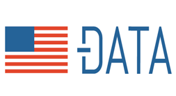

# Finding Data

Choose one of the following data sources:

|||||
| :---: | :---: | :---: | :---: |
|[NYC Open Datasets](https://opendata.cityofnewyork.us/)|[New York State Open Data](https://data.ny.gov/)|[United States Open Data](https://www.data.gov)|[United Nations Open Data](http://data.un.org/)|

Take a few minutes to explore the data source you selected.

## Sourcing data

1. Why did you choose that source to explore?
2. What sorts of data does the source provide?
3. Where does this data come from?
4. Click into a dataset and find some raw data. How difficult was that?
5. Describe the source's description of the datasets: was there enough information to indicate what data you should expect to see?
6. In what format(s) can you access the raw data?
7. Click into another dataset in the same source. Does the site give you tools to explore the data or do you have to open it in another program?

## Snowball

8. Choose a dataset in the data source you've been exploring which contains data you find interesting.
9. With a partner (who has chosen a different dataset they find interesting), brainstorm how you could mash up the two datasets.
> e.g. If one student finds traffic data and another finds restaurant data, you could mash the two datasets up to find out what restaurants are by the worst traffic so a driver could walk in and order something while they're stuck in gridlock.
10. Repeat the mashup brainstorm with two other students.

## Layering more data

11. Choose one of the ideas you came up with during the snowball that you think you'd like to investigate further. What other data would take the idea to the next level?
> e.g. For the traffic/restaurant mashup, what if we also had menu data so someone could order from their phone and the restaurant could walk it out to their car? What if we also had subway delay data so nearby restaurants could give discounts to people waiting for a train or in traffic?
12. Use the data sources above and/or Google to see if you can find an example of the data you came up with above.

## Share back

13. Share your idea with the class, and be sure to mention the various datasets you'd want to use (even if you didn't find them in one of the data sources). Each student should have at least three datasets to describe: their initial dataset, their mashup partner's dataset, and one more to layer on.
