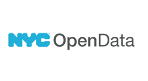

# Finding Data

Choose one of the following data sources:

| :---: | :---: | :---: | :---: |
|||||
|[NYC Open Datasets](https://opendata.cityofnewyork.us/)|[New York State Open Data](https://data.ny.gov/)|[United States Open Data](https://www.data.gov)|[United Nations Open Data](http://data.un.org/)|

Take a few minutes to explore the data source you selected.

1. Why did you choose that source to explore?
2. What sorts of data does the source provide?
3. Where does this data come from?
4. Click into a dataset and find some raw data. How difficult was that?
5. Describe the source's description of the datasets: was there enough information to indicate what data you should expect to see?
6. In what format(s) can you access the raw data?
7. Click into another dataset in the same source. Does the site give you tools to explore the data or do you have to open it in another program?
8. Find a partner and take 2 minutes to tell them about what you found.
9. Choose a different data source and compare it to the first.
10. Where else would you go to find data? Why do you think there are so many places to look for data?
11. If you were designing a data source, what would you make sure to include? What are the characteristics of a useful data source?
