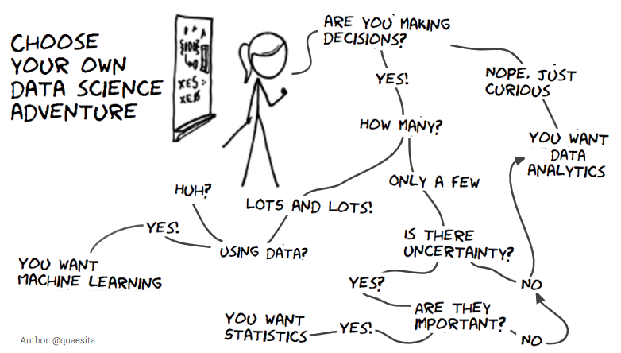

# Intro to Data Science

## What is "Data Science"?

If you've been tuned into the news, the job market, or even just looking at ads on the subway recently, you've probably come across the term "data science". Colleges and universities are offering degrees in data science, businesses are using data science to out-perform each other, and even the government at all levels (borough, city, state, federal, international) is using data science to make data-driven decisions.

But what is "data science"?

**Data science** is an umbrella term that draws upon a number of fields including mathematics, statistics, computer science, and even sociology, journalism, and design. Depending on how the term is being used, it could mean anything from statistics to machine learning and artificial intelligence.

What distinguishes the different meanings of "data science" is really a question of what you're trying to do with data:

- Are you trying to better understand the data that you have? (That's **analytics**.)
- Are you trying to make decisions based upon the data you have? (That's probably **statistics**.)
- Do you have a lot of complex data and are trying to make sense of it? (That's **machine learning**.)

Data science as a field is put into practice depending on what you want to do with data:

- **Description**: You want to understand the data you have. _e.g. Subway trains arrive late to the station 24% of the time._
- **Prediction**: You want to guess what's going to happen in the future. _e.g. Next week, ridership will increase across the subway system by 9%._
- **Prescription**: You want to say what should be done as a result of your prediction about the future. _e.g. In order to meet the anticipated increase in demand, the MTA should add 3 trains per line per hour from 7am to 7pm._

## Optional Activity: Three Questions

Think about something you do most days. Maybe you ride the subway, maybe you go shopping, maybe you check social media, maybe you spend time with your family, maybe you go to the movies. See if you can come up with three questions you could investigate about that activity:

* The first question should be **descriptive** - the answer to this question should just describe the activity. _e.g. What percentage of my time do I spend playing video games every week?_
* The second question should be **predictive** - the answer to this question is related to some future state of the activity. _e.g. How much time can I expect to spend playing games next month?_
* The third question should be **prescriptive** - the answer to this question should recommend an action based on the answer to a prediction. _e.g. What other activities should I do instead of playing video games so often?_

#### Additional Reading on Data in Journalism

Explore these resources to see how journalists are talking about - and using - data.

- [WNYC Data News](https://www.wnyc.org/tags/data_news)
- [ProPublica](https://www.propublica.org/)

#### Additional Readings on Civic Data

These readings introduce the concept of civic data, and how cities are collecting an increasing amount of data about residents, municipal activities (housing, crime, transportation, etc.), and more.

- ["The City of the Future Is a Data-Collection Machine" (The Atlantic, Nov 21, 2018)](https://www.theatlantic.com/technology/archive/2018/11/google-sidewalk-labs/575551/)
- ["On Being a Civic Data Scientist" (Medium, Aug 11, 2017)](https://towardsdatascience.com/on-being-a-civic-data-scientist-774c15232695)
- ["History of NYC's open data" (Data-Smart City Solutions, Mar. 8, 2017)](https://datasmart.ash.harvard.edu/news/article/new-york-city-open-data-a-brief-history-991)
- [How City Council uses open data to create legislation (YouTube)](https://www.youtube.com/watch?v=mrVevDEFan8&list=PLgCe1KzF20iwjeJDnI4l9OxDZKEsA6R6l&index=4) (video)

## Activity: Types of Data

See how many types of data you can brainstorm in 5 minutes. For each type, also consider potential sources of that data.

_For example, geographic data might come from satellites, from locations of users on their smartphones, from city zoning data, etc._

> Note: Think broadly! Try to consider various types of quantitative (numerical), qualitiative (textual), and alternative (images, video, sound, etc.) data. You might also think about less traditional sources of data like anecdotal data, case studies, and/or aggregate data.