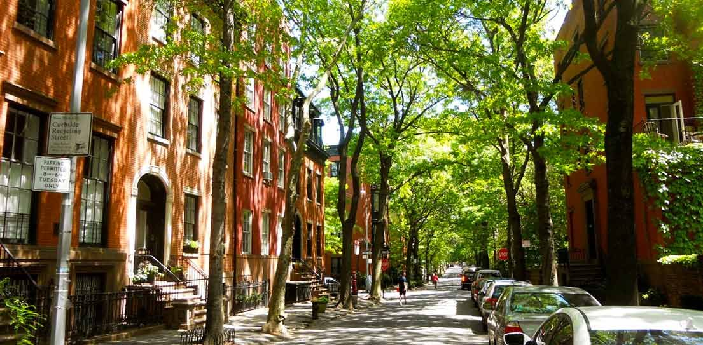

# Manhattan Street Trees

## Framing

You've been asked by the New York City Department of Parks & Recreation to analyze the status of the trees located along the streets of Manhattan in order to equitably allocate new plantings throughout the borough. They're working with a budget of **$500,000** (about 1/1000 of the department's total budget), and **need you to recommend the best trees to plant** with that money, but it's up to you and your lab partner to decide on what the word "best" means in this case. 

## Setup

- Make a copy of the [2015 Street Tree Census - Manhattan](https://docs.google.com/spreadsheets/d/1Kta3D3B6GcSdce23mIGqpRgEzVdCenC5vwGjlJaRJtY/edit?usp=sharing)

> Note: this file is a subset of [2015 Street Tree Census - Tree Data](https://data.cityofnewyork.us/Environment/2015-Street-Tree-Census-Tree-Data/pi5s-9p35) which is available on the NYC Open Data Portal. Some columns of data were removed and the data was filtered to the borough of Manhattan to be able to work in Google Sheets. Feel free to use another tool that can handle the full dataset (236 MB, CSV) if you want to extend this lab to all five boroughs.

## The Lab

1. What is the most common street tree in Manhattan?
2. What is the most common street tree in each neighborhood (`nta_name`)? in each State Assembly District? in each State Senate District?
3. How many of each type of tree are there currently in Manhattan?
4. How many of each type of tree are there in each neighborhood? Represent your answer as both a percentage of the trees in the neighborhood and a count.
5. Count the health of the various trees across the borough. Which tree(s) tend to be the healthiest? Which are the least healthy?
6. Which neighborhood(s) have the highest percent of healthy trees? Which have the lowest percent of healthy trees?
7. A manager at DEP is arguing that trees offset from the curb are always healthier than trees on the curb. Is she right? What does the data say?
8. What are the most common problems for Manhattan's street trees? Are those issues uniform across the borough or located in particular neighborhoods?
9. Which factors (root treatments, trunk treatments, branch treatments) most contribute to the health of Manhattan's street trees?
10. Based on your analysis, **make a recommendation to the Manhattan DEP** that should include:
	1. the number and location of new street trees,
	2. the type of tree(s) to plant,
	3. the preferred planting location,
	4. the best root, trunk, and branch treatments,
	5. any other information the DEP should consider when planting

## Alternatives?

- [NYC Restaurant Rating Visualization (New York Times)](http://archive.nytimes.com/www.nytimes.com/interactive/dining/new-york-health-department-restaurant-ratings-map.html)
- [NYC Restaurant Ratings Data (NYC Open Data)](https://data.cityofnewyork.us/Health/DOHMH-New-York-City-Restaurant-Inspection-Results/43nn-pn8j)
- OR [Squirrel Census](https://www.thesquirrelcensus.com/)
