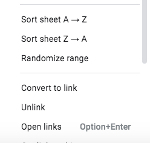

# Segmenting & Pivot Tables

## Learning Objectives

* SWBAT sort data.
* SWBAT filter data.
* SWBAT aggregate data in a PivotTable.
* SWBAT craft questions that data can answer.

## Sequence

1. [Launch](#launch)
2. [Sorting Data](#sorting-data)
3. [Filtering Data](#filtering-data)
4. [Aggregating Data in a PivotTable](#aggregating-data-in-a-pivottable)
5. [Manipulating & Visualizing Data](#manipulating--visualizing-data)
6. [Close](#close)

## Launch

Today we're going to explore a dataset of every Olympic athlete (Summer and Winter Games) since the 1896 Olympic Games in Athens. Make a copy of the [Olympic Athletes Dataset](https://docs.google.com/spreadsheets/d/1Q2iJtAOdec18Ufh_2lcvOLHSl37rDKOFfU5i4n1odqw/edit?usp=sharing), and begin by exploring the data.

1. Make a prediction about the following:
- What country has won the most Olympic medals in history?
- In what year did the greatest number of athletes participate in the Olympics?
- Which has more events: the Summer or the Winter Olympics?

2. Based on your exploration of the dataset, come up with three original questions you could ask of this dataset.
> e.g. How many gold medalists has Bulgaria produced?
> e.g. How many athletes from the United States have been in the Olympics?
> e.g. What is the average weight of all silver medalists in the 1988 Winter Olympics?

## Sorting Data

Some questions can be answered simply by sorting data. For instance:

- Who is the heaviest Olympic athelete ever, and what is their weight? Who is the lightest, and what is their weight?
- Who is the oldest Olympic athlete ever, and what is their age? Who is the youngest, and what is their age?
- Who is the tallest Olympic athlete ever, and what is their height? Who is the shortest, and what is their height?

Answer these questions by sorting the worksheet by the correct column. To sort, click on the down arrow in the column header, then choose `Sort sheet A → Z` for descending order or `Sort sheet Z → A` for ascending order:

Questions that can be answered by sorting don't require any complex filtering or aggregation of data; the data is already in the right format and we simply want to see what's on the top or bottom of a sorted list.

> You can always reset the sheet to its original sort by sorting on the `ID` field.

## Filtering Data

To answer some questions you want to filter out data and only show (or not show) certain things. Filtering can be used in combination with sorting to answer slightly more complex questions:

- Who is the oldest Olympian from Canada, and how old were they when they competed?
- What event(s) did the first South African Olympian(s) participate in?
- Which countries won the gold, silver, and bronze medals in the Rowing Men's Coxed Eights in the 1964 Summer Olympics?

To filter data, we have to turn on filters for the entire table. Select the entire table by clicking in the top-left-most box (to the left of Column A), and then select "Data > Create a filter" from the top menu bar or tap the filter icon in the toolbar: 

Create a filter view, then use the resulting dropdowns to limit the data that is shown so you can answer the questions above.

> Note: if you just want to show the Canadian athletes, first select "Clear all", then check the boxes next to "Canada" (and "Canada-1", "Canada-2", and "Canada-3")
>
> Then, when you're ready to show all data again, click on the filtered column and choose "Select all", then "OK" - or you can choose "Data > Turn off filter" from the top menu bar to remove all filtering.

## Aggregating Data in a PivotTable

Answering some questions requires more than complex sorting and filtering, especially questions where we want to aggregate data using mean, median, mode, etc. This is where we need to use PivotTables. Questions best answered using a PivotTable include:

- How many American athletes participated in the 2002 Winter Games in Salt Lake City?
- How many Russians have won a gold medal across all Olympic Games?
- How many medals has each country won in every Olympic Games?
- What is the average height, age, and weight of a gold, silver, and bronze medal winner?

PivotTables are built by specifying the data that is meant to populate the rows, columns (optional), and cells of a table, along with any column that is meant to be used to filter the data. Additionally, cells can calculate averages, counts, or other statistical measures of any data matching that row and column.

To build a PivotTable, tap "Data > Pivot table", then follow the prompt to select all of the data and put it in a new sheet. Then use the helper box at the right of the screen to select fields for the rows, columns (optional), cells, and filters for the PivotTable.

> Note: It may take a bit for the helper box "Suggestions" to load, especially with larger data files, but you can go ahead and add rows and columns while it's loading.

## Manipulating & Visualizing Data

Sometimes you still need to manipulate the data once you've aggregated it in a PivotTable. We won't cover data manipulation here, but some questions you might try to answer on your own include:

- What percentage of the overall American gold medals were won since the 2000 Summer Games?
- Is there a correlation between Olympic athletes' height and weight? Has that relationship changed over time?
- Build a map of every Winter Olympic Games where Jamaica has participated.

> Note: There are many ways to answer these questions!

As we'll learn later, Google Sheets has a bunch of built-in data visualizations that can also help answer some of these questions.

## Close

Today we learned about several ways to work with data, with a focus on sorting, filtering, and aggregating. Take a moment to think about how you sort, filter, and aggregate in your daily life, and give an example of how you use each technique.
> e.g. When I do my laundry, I sort the lights and darks before I wash them. Then, I like to filter everything into piles before I fold my laundry because it makes it easier for me to find socks and I get in the rhythm of folding shirts. Lastly, I make a mental note of how many clean t-shirts I have left to wear when I put my clothes away; the count of the t-shirts is an aggregate representation of all of my t-shirts.
