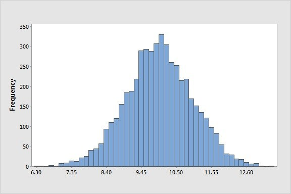
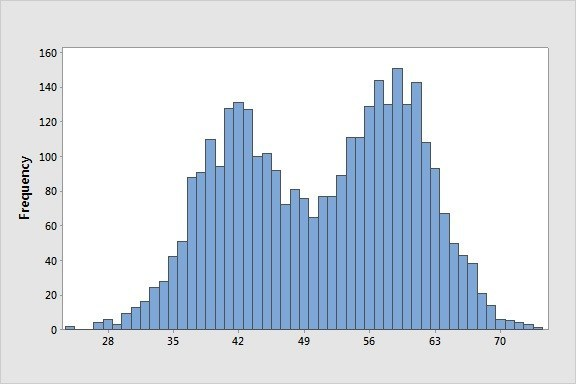
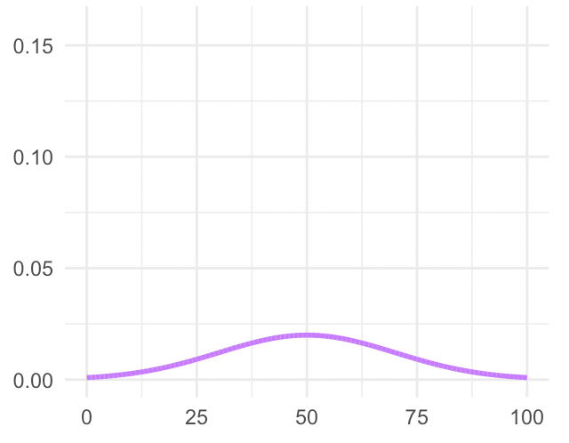
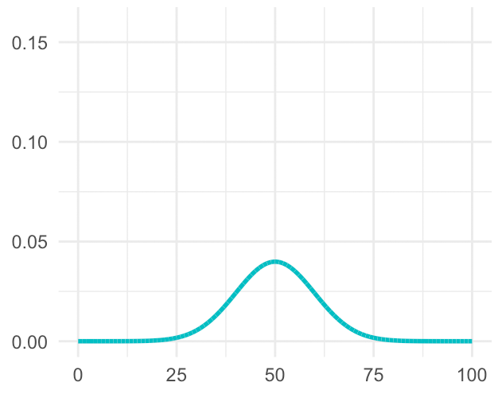
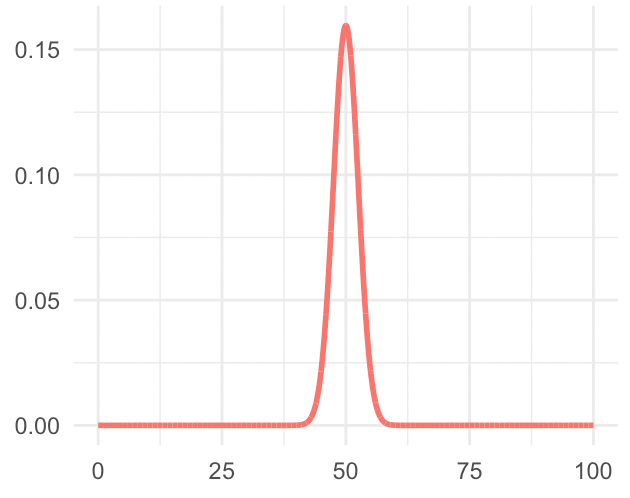
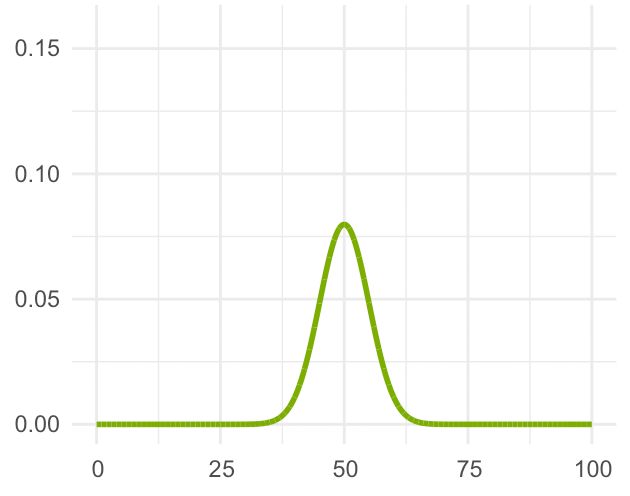

# Statistics

## Learning Objectives

* SWBAT use statistical measurements (mean, median, mode, variance, quartiles) to interpret data.

## Sequence

1. [Intro](#intro)
2. [Mean, Median, Mode](#mean-median-mode)
3. [Variance](#variance)
4. [Quartiles](#quartiles)
5. [Other Statistical Descriptions](#other-statistical-descriptions)
6. [Close](#close)

## Intro

You may remember from previous math classes where you've been taught how to calculate the mean, median, and mode of a set of numbers. The focus of this lesson is not on the mathematics of how to do those calculations (and others), but instead on what those numbers represent. This less will give you a better understanding of how useful statistical measurements can be and how to ask whether or not they're the right way to summarize a set of data. 

## Mean, Median, Mode

#### Review on calculations

Recall how to calculate these statistical values:

- Mean (also called the average): to calculate the mean, we add up all of the values in a set of data and then divide by the number of values in the set.
- Median: to calculate the median, we arrange all of the values in increasing order and count to the middle number.
- Mode: to calculate the mode, we arrange all of the values in increasing order and identify which value occurs most often.

#### Example

Consider a dataset of exam scores: [100, 86, 90, 93, 75, 40, 66, 98, 90, 79, 88]

- The mean is: (100 + 86 + 90 + 93 + 75 + 40 + 66 + 98 + 90 + 79 + 88)/11 = (905)/11 = 82.27
- Rearranging the values in increasing order: [40, 66, 75, 79, 86, 88, 90, 90, 93, 98, 100]
	- There are 11 total values, so the median is the 6th value: 86
	- The mode is the value that occurs most often: 90

Think about why computers are particularly good at calculating the mean, median, and mode. Could you write a function that would calculate each statistical measurement?

### Understanding Distributions

You've probably been able to calculate the mean, median, and mode of a set of values using your calculator or even a computer, but what happens when the number of values in the data set goes from 11 (above) to 11 million? Do you think these statistical measurements are as meaningful?

Instead of boiling down 11 million numbers to one of these three statistical values, data scientists will often instead prefer to look at the distribution of the values to get a better sense of the data. Distributions are difficult to calculate by hand, but they are a graphical way to know whether the values in a data set are evenly spread around some central value, whether there are more greater values or lesser values (whether the data is skewed), or even whether the data is composed of multiple features that might be grouped around particular values. Distributions can be represented as column (bar) charts or line charts; column charts are used when there is a relatively small number of possible discrete values in the dataset, and line charts either to approximate many many more discrete values or when the data is continuous. In each case, the x-axis represents the value and the y-axis represents the number of times that value is in the data set, or that value's frequency.

Some distributions are bell-shaped; you may have heard of a Bell curve. Other distributions are shifted one way or another, e.g. a Boltzmann distribution. Still others have more than one hump; a distribution with two humps is called "bimodal". Other distributions may have values that are evenly distributed, and those are called "uniform" distributions.

Let's take the skewed-left distribution below. Visually, the mode is the easiest statistical measurement to determine from a graph; it's the high point because that represents the value that occurs most often in the data. The mean and median are a bit trickier and generally depend on the shape of the distribution. For the skewed-left distribution below, the value of the median is a bit higher than the value of the mode; to visually determine the median, imagine drawing a line that has equal area on the left and the right sides of the line. Lastly, the value of the mean is a bit higher than the value of the median because the few larger values have the effect of pulling the mean up relative to the median. 

Consider the distributions below:

#### Bell-Shaped Distribution

#### Skewed Left Distribution

#### Skewed Right Distribution

#### Bimodal Distribution

#### Uniform Distribution

For each distribution, can you guess-timate (guess + estimate):
- What is the value of the mode of each dataset?
- What is the value of the median of each dataset?
- What is the value of the mean of each dataset?

Now consider these three datasets represented below by the bold, thin, and dotted lines:

For each distribution, can you guess-timate:
- What is the value of the mode of each dataset?
- What is the value of the median of each dataset?
- What is the value of the mean of each dataset?

As you can see, unfortunately just determining the mean, median, and mode is not sufficient to distinguish between these three datasets. For that, we need a new measurement: the variance.

## Variance

Without going too deep into the mathematics about distributions, you have seen (above) how some datasets look more spread out than others. The more spread out the values in a dataset are, the larger the variance of the dataset. The more closely aligned the values in a dataset are, the smaller the variance of the dataset.

Variance helps a data scientist gauge how uniform or distributed the values in a dataset are.

See if you can arrange the following datasets in terms of increasing variance. What conditions must be true in order to visually compare various datasets?

<table>
	<tr>
		<td></td>
		<td></td>
	</tr>
	<tr>
		<td>Distribution 1</td>
		<td>Distribution 2</td>
	</tr>
	<tr>
		<td></td>
		<td></td>
	</tr>
	<tr>
		<td>Distribution 3</td>
		<td>Distribution 4</td>
	</tr
</table>

#### Distribution 1

#### Distribution 2

#### Distribution 3

#### Distribution 4

## Quartiles

Some text

Include distributions with same center, difference spreads, broken down into quartiles.

Can also talk about standard deviations from the average.

### Activity: Some text

Some text

## Other Statistical Descriptions

Some text

Maybe root-mean squared, maybe standard deviations, maybe some others?

### Activity: Some text

Some text

### Some text

Some text

### Takeaways

* Topic - Some text
* Topic - Some text
* Topic - Some text

## Close

Some text
