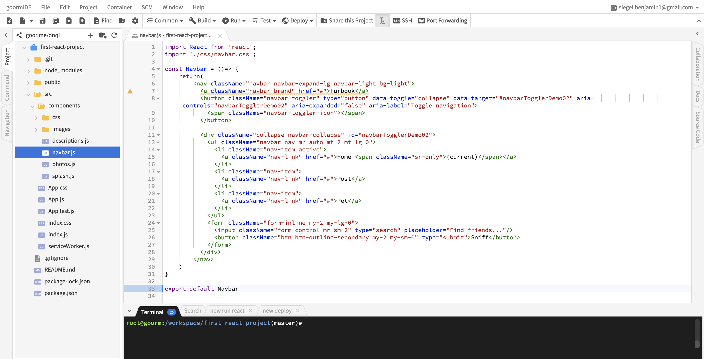

# Functional Components in React

## Learning Objectives

* SWBAT separate HTML into individual components
* SWBAT reuse a component multiple times in a React project
* SWBAT modify the HTML in a component that has already been written
* SWBAT export a functional component and import it into other files

## Sequence

1. [Launch](#launch)
2. [Functional Components](#functional-components)
4. [Close](#close)

## Launch


Clone the Pet Book repository before the start of this lesson at https://github.com/upperlinecode/pet-book. Run the website and display it to students at the start of the lesson. Ask them to make predictions about what code was used to build this website. Once students have made their predictions, open the App.js file and show students the contents of this file. Were their predictions correct?

> ### Teacher Note
>
> The "reveal" of this launch is to show the students the `App.js` file to how that only a few lines of code were used to build the entire website. This introduces students to the idea of a React **component**. When we build a React application, we generally construct it by piecing together components. Of course, the code for each component can be found in other files of the application, but it is important to note how clean and simple the the code in a React project can look by separating the code into individual components.

```js
import React, { Component } from "react";
import Navbar from "./components/navbar.js";
import Splash from "./components/splash.js";
import Photos from "./components/photos.js";
import Descriptions from "./components/descriptions.js";

import "./App.css";

const App = () => {
  const component = new React.Component()

  component.render = () => {
    return(
      <div className="App">
        <Navbar/>
        <Splash/>
      	<Photos/>
      	<Descriptions/>
      </div>
    )
  }

  return component
}

export default App;
```

#### Questions for Students

* What code do you think was used to make this website. Be specific - what HTML tags were used to create different elements that you see on the site?
* How many lines of code do you think were used to build this website?
* If you had a pet, would they enjoy using this website?

## Functional Components

In this lesson we will be exploring **functional components**. We want students to walk away with three major understandings:

* Components are reusable: a component can be used more than once. This leads to writing significantly less code.

* Components are divided into individual files. This is not required but helps organize React projects so they easy to read and edit.

* Functional Components are written as JavaScript functions that **return** a block of HTML.

Here's what's happening in the code above:

```js
// This is an App function which...
const App = () => {
  // Creates a component
  const component = new React.Component()

  // Defines that component's render function, which...
  component.render = () => {
    // Returns the HTML
    return(
      <div className="App">
        <Navbar/>
        <Splash/>
      	<Photos/>
      	<Descriptions/>
      </div>
    )
  }

  // Finish the functional component by returning that component we created at the start.
  // This component will have its render function called by by React itself.
  return component
}
```

### Components are reusable

Let's try an experiment. What would happen if we added another Navbar to our existing code? Preview the website so students can see the result of the added `<Navbar />`.

```js
const App = () => {
  const component = new React.Component()

  component.render = () => {
    return(
      <div className="App">
        <Navbar/>
        <Navbar/>
        <Splash/>
      	<Photos/>
      	<Descriptions/>
      </div>
    )
  }

  return component
}
```

There are two Navbars now! How easy was that?! This should illustrate to students the reusability of React components. Have students try the mini-challenges below.


#### Mini-Challenges

* Can you add five `<Navbar />` components to the Pet Book website?
* Can you add three `<Splash />` components to the Pet Book website?
* Can you add two `<Photo />` components to the Pet Book website?
* Can you add eight `<Description />` components to the Pet Book website?

### Components are separated into different files

Let's explore what is going on under the hood. The HTML for each component has to be written somewhere, right? You are correct! Let's open the component directory to see what files are inside.



You will see four files when you open the component directory. When you open each file, there is the HTML for each individual component.

Most of the code you see should look familiar. This is normal HTML with one slight different. Instead of using the `class` attribute we use `className` in React projects. This is to avoid conflicts between JavaScript classes and HTML classes.

You will also notice an `export` statement at the end of each file. This `export` statement allows other files to access the code in each component file. You will notice that when you want to use a component in other areas of your project, you must `import` that component first. Look back at `App.js` to see that each component has been imported at the top of the file. You might want to make an analogy to students that when a country exports goods there must be another country that imports it - or else it'll just be floating the middle of the ocean forever!

> ### Note To Teachers
> 
> This is likely a good time to discuss JSX with your students. React uses JSX to combine HTML and Javascript into a single file. This will come in handy later when we want to add JavaScript functionality to our components. To learn more, go to https://reactjs.org/docs/introducing-jsx.html

### Components are JavaScript functions

You will notice that the HTML for each component is written inside of a function. In React, components can be written as JavaScript functions that **return** an HTML code block every time that component is called. It is important to remember that the function *must* contain a **return** statement, or no HTML will be rendered to the screen.

There are TWO ways to code out functional components.

#### Functional Component Option 1: TRUE Functional Components

The first is a TRUE functional component. It skips the creation of a full React component and simply returns some JSX (which looks a lot like HTML). A true functional component relies primarily on return values - there can be additional JavaScript added in before the return statement, but in general this is not necessary.

```Javascript
// True functional component
const Example = () => {
	return(
		<div>
      //Block of JSX/HTML code goes here
		</div>
	);
};
```

#### Functional Component Option 2: Functional Components as Constructors

The second method is a functional component as a constructor. This type of functional component operates in 3-4 chunks.

1. Create the component.
2. Modify the component - only necessary when implementing some more advanced methods.
3. Write the component's render method.
4. Return the component.

```javascript
// Functional component as Constructor
const Example = () => {
  // 1. create a component.
  const component = new React.Component()

  // 2. modify the component - we won't do that until later in the unit.

  // 3. Write the component's return method.
	component.render = () => {
    return(
		<div>
      //Block of JSX/HTML code goes here
		</div>
	)}

  //4. Return the component
  return component
}
```

For now, either method works, so in order to get practice with both, we'll use the more complex method (Option 2 - functional component as constructor) for the `App.js` component, since it will probably need more complex functionality sooner than the others, and we'll use the simpler true functional components (Option 1) for our simpler components like the `<Navbar />` and its sibling components.

> Note: as we'll learn later when we discuss state, the constructor approach (Option 2) is used as [a work-around for writing Class-based components](https://medium.com/@baronmaximilianwilleford/react-without-this-39a76b8f2160). In order to keep things simple, all components will be written as functions in this course; we won't discuss Class-based components, however students may encounter them if they continue to work with React.

Components can technically only return a single element, but other elements can be nested inside that one. If you want to return multiple HTML elements, then all of your HTML must be wrapped in a single parent element. The `<div>` in the examples above is a good way to do that.

#### Mini-Challenges

* Change the "sub-text" in the Description component
* Change the "value" attribute of the input in the Navbar component
* Add another `<h5>` tag in the splash page with a quote about animals
* Extension - Change the color of the `<Navbar />`.

## Close

Remember to gather student feedback on this lesson. In addition to the standard close, consider asking students the question below before ending class.

#### Question for Students

* The components we looked at today always returned the same HTML. What functionality could we add to these components to make them for useful?
