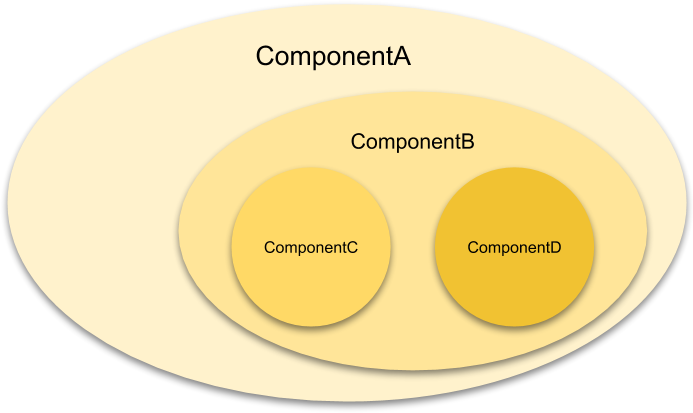

# Parent & Child Components

## Learning Objectives

- SWBAT articulate the difference between parent and child components
- SWBAT break down a page into parent and child components
- SWBAT rearrange existing code into parent and child components

## Sequence

1. [Launch](#launch)
2. [Parents & Children](#parents--children)
3. [Rearranging Components](#rearranging-components)
4. [Close](#close)

## Launch

Let's all clone [this repository](https://github.com/upperlinecode/react-parent-child-lecture) and take a look at the code.

Based on what you know so far, how would you accomplish the following modifications to this code:

- Add an "Honors" section for each student.
- Make all Senior quotes in _italics_.
- Move each student's name above their picture.

#### Questions for students

- How tedious did you think it would be to make those changes?
- Can you think of a more efficient way to arrange the code so that changes like those are not so laborious?

## Parents & Children

As you've seen, it's possible to break code up into functional components to make it easier for a developer to manage the code in different parts of a React app. It's worth recognizing, however, that components can use (or be used by) other components. This makes code a bit more structurally semantic (it gives it more meaning), instead of just duplicating the way you might build an app in HTML.

When component A uses component B as part of its `return` statement, component A is referred to as the "parent" of component B, and component B is referred to as the "child" of parent A. Component B could, in turn, be built from other components - say components C and D. In this case, component B is the "parent" of components C and D, and components C and D are the "children" of component B. Component B is the "child" of component A and the "parent" of components B and C.

#### `./ComponentA.js`
```javascript
import React from 'react'
import ComponentB from './ComponentB'

const ComponentA = () => {
  return (
    <ComponentB />
  )
}

export default ComponentA
```

#### `./ComponentB.js`
```javascript
import React from 'react'
import ComponentC from './ComponentC'
import ComponentD from './ComponentD'

const ComponentB = () => {
  return (
    <div>
      <ComponentC />
      <ComponentD />
    </div>
  )
}

export default ComponentB
```

#### `./ComponentC.js`
```javascript
import React from 'react'

const ComponentC = () => {
  return (
    <div>
      // Some code
    </div>
  )
}

export default ComponentC
```

#### `./ComponentD.js`
```javascript
import React from 'react'

const ComponentD = () => {
  return (
    <div>
      // Some code
    </div>
  )
}

export default ComponentD
```

The parent-child relationship is all about nesting.

 

#### Mini-Challenges

- Revisit the app we started with, and think about how it could be rearranged into nested components.
- Map out (on paper) the nested structure of the app into granular sub-components. What is/are the most granular functional components you would make?

## Rearranging Components

Now that you've had a chance to think about how to restructure the app above, try to implement that restructuring:

1. Break apart the code into functional components
  1. Tip: start by breaking the code into large components, then try to break those components into smaller components.
  2. Keep an eye out for any code you might be able to package into a component and reuse.
2. Keep breaking the code into separate functional components until you are satisfied that the functional components are as granular as they should be.
  1. Remember to include the necessary `import` and `export` statements when you create new functional components:
  ```javascript
  import React from 'react'
  import AnotherComponent from './AnotherComponent'

  const ComponentName = () => {
    return (
      // Some code
    )
  }

  export default ComponentName
  ```
  2. Remember to include a new `import` statement wherever you use a new functional component.
  3. Remember to replace the code you abstract into the functional component with the component name: e.g. `<ComponentName />`.

## Close

Think back to the three changes that you were asked to make at the beginning of this lesson. Take a moment to make those changes to your app now that you've broken it apart into nested functional components:

- Add an "Honors" section for each student.
- Make all Senior quotes in _italics_.
- Move each student's name above their picture.

> It's possible that you may have to duplicate components that are used elsewhere in order to make changes in only certain circumstances. Don't forget to create a new component name, export it, and import it (where necessary).

#### Questions for students

- Was it easier/harder to make the changes now that you've restructured the app?
- What are the challenges to working with an app that has a lot of child components, many of which might have child components, some of which might have child components?
