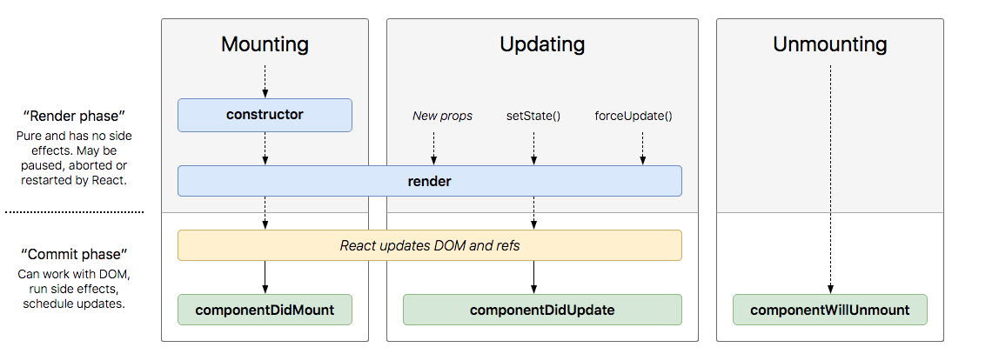

# State (Lifecycle methods, passing state among elements)

## Learning Objectives

- SWBAT pass state between components using props
- SWBAT explain when to use various lifecycle methods
- SWBAT add a lifecycle method to a functional component

## Sequence

1. [Launch](#launch)
2. [Passing State Among Elements](#passing-state-among-elements)
3. [Lifecycle Methods](#lifecycle-methods)
4. [Close](#close)

## Launch

In the last lesson, we learned about state in functional components and how inline events can be used to modify state.

#### Questions for students

Think back over the last few things you've learned about React:

- How would you make it so that a child component is affected by a change in state of a parent component?

## Passing State Among Elements

### Passing State as props

Often, we'll want to pass state from a parent component to a child component, and we do that by passing state as a prop (or set of props). Whenever the parent state is updated, the update will trickle down to child components via props and update the child as well.

```js
// example of passing state as prop(s)
```

[INSERT FOLLOW-ALONG TO PASS STATE VIA PROPS]

#### Mini-Challenges

- Create a new functional component, `NewComponent`, that receives state from the `App` component and displays the `______` property.
- Modify your code above so `NewComponent` shows `"Some text"` if `isTrue` is `true`, and `"Some different text"` if `isTrue` is `false`.
- Add a new property to the state, and use it in `NewComponent`.
- Create another component, `ChildComponent`, that is a child of `NewComponent`. Pass the state of `NewComponent` to `ChildComponent` and show (something).

## Lifecycle Methods

Sometimes a developer will want to control how components are added (mounted), how and when they are updated based on changes to props and state, and how they are removed (unmounted) from an app. Instead of relying on React to always know when to mount, update, and unmount components, we can use lifecycle methods to instruct React exactly how a component should act throughout its existence.



> View an interactive version of this diagram on [projects.wojtekmaj.pl](http://projects.wojtekmaj.pl/react-lifecycle-methods-diagram/).

The **most common** lifecycle methods are:

### Mounting

| Lifecycle Method | Description | Most useful for ... |
| :---: | --- | --- |
| `componentDidMount` | What to do once your component is there | Executing an API call for data that will be used to populate the component's props |

### Updating

| Lifecycle Method | Description | Most useful for ... |
| :---: | --- | --- |
| `componentDidUpdate` | What to do when a component gets new props or new state | Making a change only when particular props or state is changed |

### Unmounting

| Lifecycle Method | Description | Most useful for ... |
| :---: | --- | --- |
| `componentWillUnmount` | To control what happens before a component is removed | Cleaning up after a component |

> Check the [React Developer Documentation](https://reactjs.org/docs/react-component.html) for a full list of supported (and unsupported) lifecycle methods.

### Using Lifecycle Methods

Some text about using lifecycle methods... You won't use all of them, and you often won't use any of them...

```js
// example of how to modify a functional component to include a lifecycle method
```

[INSERT FOLLOW-ALONG FOR ADDING A LIFECYCLE EVENT]

## Close

Some text here

#### Questions for students

> Some question
