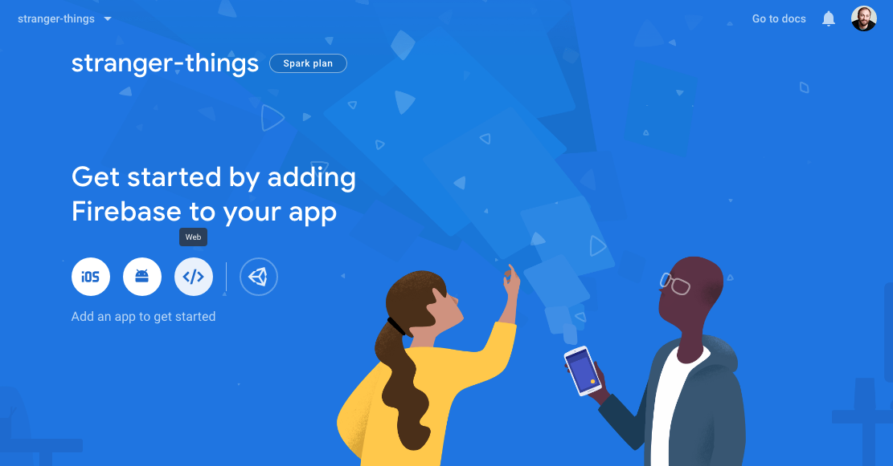
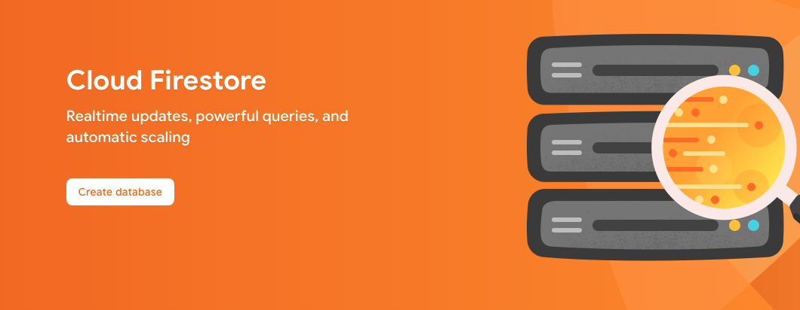
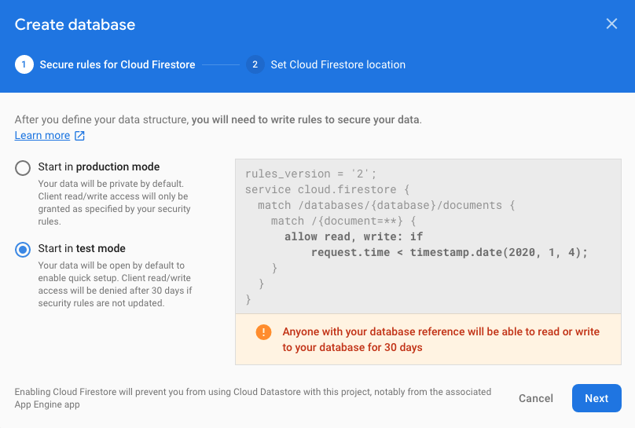
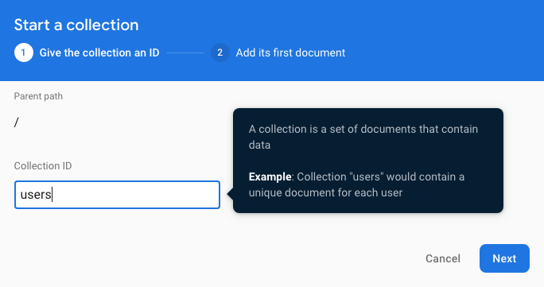

# Getting Started with Firestore

## Learning Objectives

- SWBAT set up a Firebase account
- SWBAT initialize a Firestore database

## Sequence

1. [Getting Started with Firestore](#getting-started-with-firestore)

## Getting Started with Firestore

Unfortunately, Google's Firestore documentation doesn't have a Getting Started Guide for (Facebook's) React, so a quick google for "react firestore web" and some poking around yields several helpful posts about setting up Firestore and integrating it with React. If you'd rather follow along with one of those, check out this [Medium post about React + Firestore](https://medium.com/get-it-working/get-googles-firestore-working-with-react-c78f198d2364).

To get up and running with Firestore in React, we need to do the following things:

1. Install the `firebase` library to our development environment
2. Sign up for a Firebase account
3. Add a new Firebase project
4. Integrate Firebase into our React app
5. Set up a database and collection in Firestore

Before you get started, you can either integrate Firestore into one of your existing React projects, or you can `git clone https://github.com/upperlinecode/react-project-template` and follow along there.

#### 1. Install the `firebase` library to our development environment

To install the firebase library to our development environment, we just need to:

```javascript
npm install firebase
```

> Note: If you're having trouble installing firebase, try `npm install --save firebase` instead.

Easy! You should now see `firebase` and an automatically-generated version number in your `package.json` file.

```javascript
"firebase": "^7.4.0",
```

> Note: It's ok if you see a different number than `^7.4.0` - depending on when you're reading this, Firebase may have released a newer version since we wrote these lessons.

#### 2. Sign up for a Firebase account

> Watch this [video walk-through](https://youtu.be/dAE4QdP-c7s) to help you as you're signing up for Firebase.

From the Firebase homepage [https://firebase.google.com](https://firebase.google.com), sign in using a Google account or sign up and make yourself a new Google account.


Once you're logged in, you'll see a page where you can "Create project" (or "Add project" if you already have a firebase account).

Tap the "Create project" button to add a new Firebase project. 

#### 3. Add a new Firebase project


Give your project a name, e.g. `stranger-things`, and go ahead and agree to the checkbox prompt. Then, it's up to you if you want to use Google Analytics on your project; if you do, you'll have to agree to a few more checkboxes. Tap "Create Project" to finish up this step.

#### 4. Integrate Firebase into our React app



Next tap the "`</>`" button to add Firebase to your web app (since our React app is web-based).


We'll then give our app a new name (it can be the same as the project name). You don't need to check the **Firebase Hosting** checkbox. Then tap "Register app".


Copy the code between the bottom set of `<script>` tags, e.g.:

```javascript
var firebaseConfig = {
   apiKey: "AIzfhrwkKhDBFHbntnKhTahHjkNK6FG875dSB6y",
   authDomain: "typecode-76g33.firebaseapp.com",
   databaseURL: "https://typecode-76g33.firebaseio.com",
   projectId: "typecode-76g33",
   storageBucket: "",
   messagingSenderId: "547432956432"
};

firebase.initializeApp(firebaseConfig);
```

Tap "Continue to console" to go back to the Firestore console.

Back in your React app, let's make a new Component, e.g. `Firestore.js`. In `Firestore.js`, add the necessary `import` and `export` statements, and paste the code you copied above between those.

> Note: you can also change `var` to `const`.

```javascript
import firebase from 'firebase';

const firebaseConfig = {
   apiKey: "AIzfhrwkKhDBFHbntnKhTahHjkNK6FG875dSB6y",
   authDomain: "typecode-76g33.firebaseapp.com",
   databaseURL: "https://typecode-76g33.firebaseio.com",
   projectId: "typecode-76g33",
   storageBucket: "",
   messagingSenderId: "547432956432"
};

firebase.initializeApp(firebaseConfig);

export default firebase;
```

> Note: Don't copy and paste these config variables, they are just an example. You should use the configuration variables from your Firebase account.

#### 5. Set up a database and collection in Firestore


Head back to your Firebase console, and choose the "Database" option from the left "Develop" menu.



Tap "Create database".



For now we'll start our development in "test mode" which means anyone can read or write from our database.

> Note: when moving an app out of development and into production, Firestore suggests converting this security setting to "locked mode". When you do this, you'll need to set the security settings for your app related to who can `read` and who can `write` to your app. For more on this, check out [Firestore's Documentation on Security](https://firebase.google.com/docs/firestore/security/get-started).


You'll also be asked to choose a geographic region for your database. We suggest `us-east1` so data will have less far to travel to and from the database server.

Then tap "Done". Firestore will take a moment to "provision" your database, which means they're setting up a new instance of Firestore just for you with the appropriate configuration and storage capacity. You'll then be directed to your database page.


Now that you have a database, you need to create a collection within that database where records can be stored. You can think of this like the different worksheets within an Excel or Google Sheets spreadsheet.



To create a collection, tap the "Start collection" option and give your new collection a name, e.g. `users` or `data` - it can be anything, but we'll use this name later to indicate where we want to write data to.


Once you've clicked "Next", you'll be asked if you want to create a Document ID. We suggest leaving this blank or tapping "Auto ID" so Firestore will generate a unique ID for you. Below the Document ID, you'll be asked to create an initial document in order to initialize the collection; add one or more data fields, e.g. `name`, but it's ok if we want to add different fields later.

Tap "Save".


Now that we have a database with a collection and we've integrated our Firebase credentials into our React project, we're ready to start CRUD-ing!
