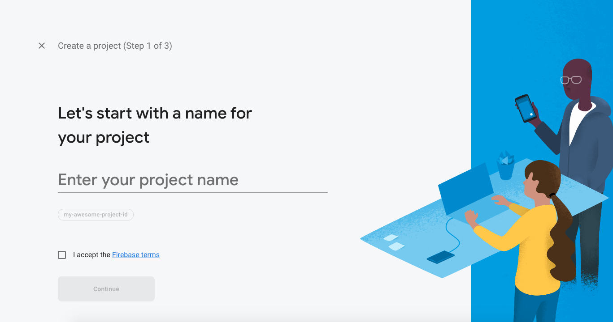
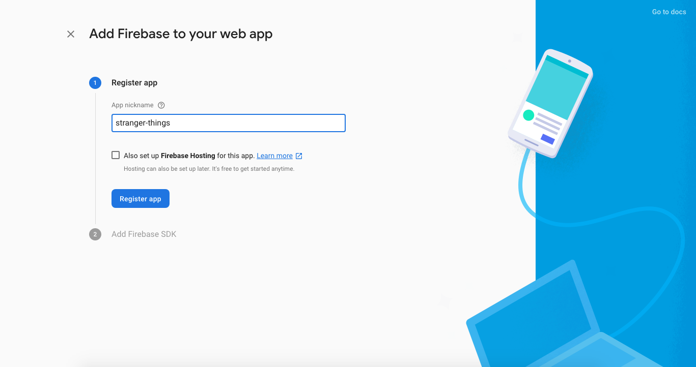
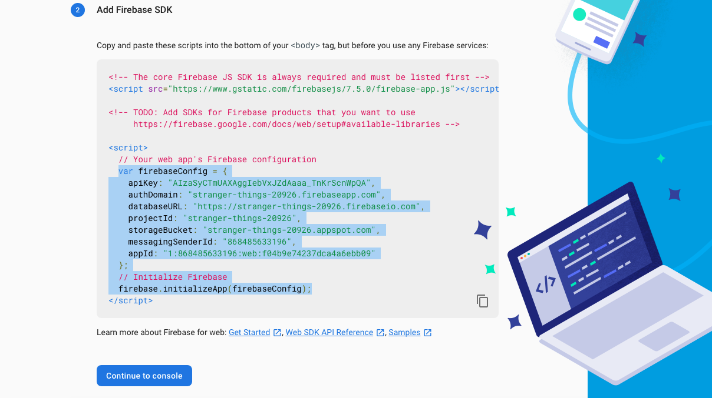
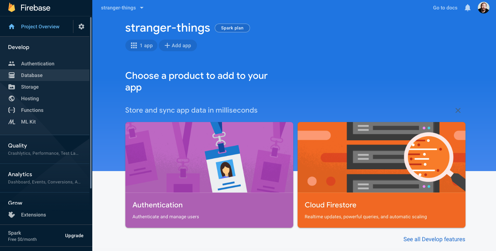
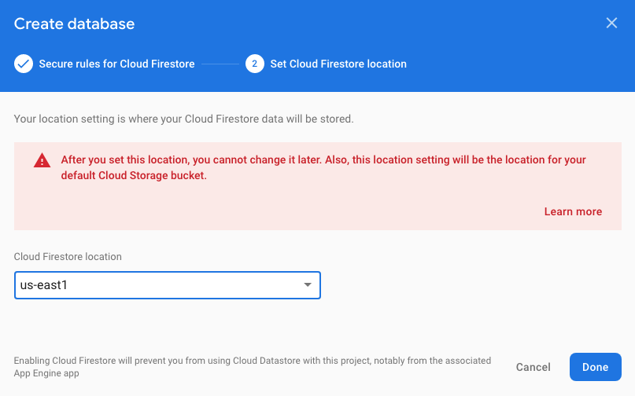
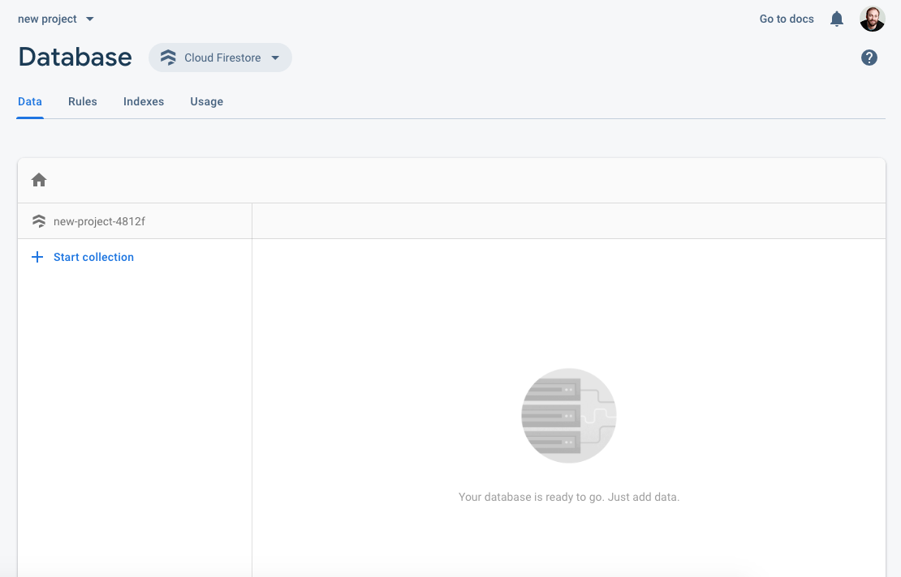
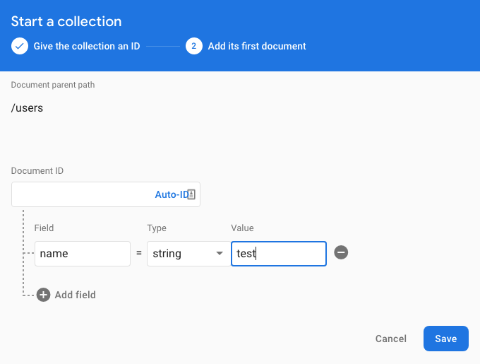
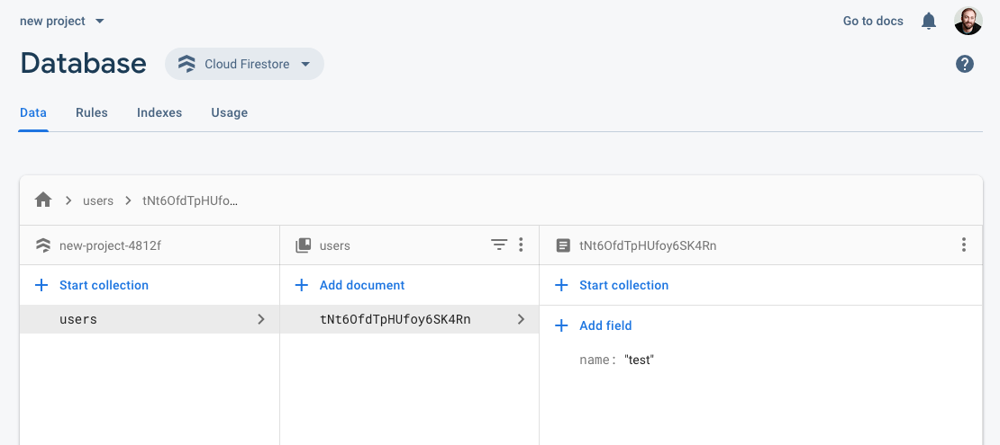

# Storing Data with JSON & Firebase

## Learning Objectives

- SWBAT 

## Sequence

1. [Launch](#launch)
2. [JSON Review](#json-review)
3. [Firebase's Firestore](#firebase's-firestore)
4. [Setting Up Firestore](#storing-to-firestore)
4. [Storing to Firestore](#storing-to-firestore)
5. [Reading from Firestore](#reading-from-firestore)
6. [Updating in Firestore](#updating-in-firestore)
7. [Deleting from Firestore](#deleting-from-firestore)
8. [Close](#close)

## Launch

Click on this link and see if you can figure out what this data describes: [https://data.cityofnewyork.us/resource/vfnx-vebw.json](https://data.cityofnewyork.us/resource/vfnx-vebw.json)

### Questions

- Do the property names give you any indication of what information the data captures?
- Come up with three questions you might try to interrogate using this data. 

## JSON Review

Examine this (slightly better formatted) sample of the data linked above:

```javascript
[
  {
    "x": "-73.9561344937861",
    "y": "40.7940823884086",
    "unique_squirrel_id": "37F-PM-1014-03",
    "hectare": "37F",
    "shift": "PM",
    "date": "10142018",
    "hectare_squirrel_number": "3",
    "combination_of_primary_and": "+",
    "running": false,
    "chasing": false,
    "climbing": false,
    "eating": false,
    "foraging": false,
    "kuks": false,
    "quaas": false,
    "moans": false,
    "tail_flags": false,
    "tail_twitches": false,
    "approaches": false,
    "indifferent": false,
    "runs_from": false,
    "geocoded_column": {
      "type": "Point",
      "coordinates": [
        -73.9561344937861,
        40.7940823884086
      ]
    },
    ":@computed_region_f5dn_yrer": "19",
    ":@computed_region_yeji_bk3q": "4",
    ":@computed_region_92fq_4b7q": "19",
    ":@computed_region_sbqj_enih": "13"
  },
  ...
]
```
> From the [2018 Central Park Squirrel Census - Squirrel Data](https://data.cityofnewyork.us/resource/vfnx-vebw.json).

By now you should be comfortable with JSON, but it's worth a refresher here before we jump into storing data on Firebase.

- JSON is usually made up of objects and arrays. Above is an array (the `[]`) of objects (the `{}`).
- Objects can themselves be made up of objects and arrays, e.g. `"geocoded_column"` is an object which contains the array `"coordinates"`.
- Most of the data you will see from NYC Open Data will have a fairly flat (non-nested) data architecture. This way of storing data can be useful because it enables a developer to easily address parts of records with dot notation, e.g. `record.running` is `false`, or to get a value nested in an object and then nested in an array: `record.geocoded_column.coordinates[0]` would yield `-73.9561344937861`.

## Firebase's Firestore

Databases enable users to store data in a centralized location so that data can be available to them irrespective of the device they use. Additionally, databases allow developers to centralize where and how data is stored so they can make sense of a broad set of information.

Firebase is a database solution from Google which has a lot of different products and features. Here, you'll be introduced to Firebase's [Firestore](https://firebase.google.com/docs/firestore) database. Firestore is an object store, meaning it can store each new bit of data in its own record. What's really revolutionary about Firestore, however, is that adding, updating, or deleting data can trigger an event that can be used by a developer to do something else; the real-time call-and-response has many useful applications.

> Read more about Firestore in their [documentation](https://firebase.google.com/docs/firestore).

- If you've already done the [API mini-unit](./react-apis.md), you can imagine Firestore as setting up your own read/write API.

### CRUD: Create, Read, Update, Delete

There are 4 main operations a database needs to be able to do: create, read, update, and delete.

- Creating data means making a new record in the database.
- Reading data means finding a record in the database and getting that data.
- Updating data means finding one or more records in the database and changing them.
- Deleting data means finding one or more records in the database and removing them from the database.

## Setting Up Firestore

Although Firestore is fairly language agnostic and you can use it with many different programming languages, the remainder of this lesson will use Firestore with React.

And because we'll be using React, you should also review the lesson on [Lifecycle Methods](passing-state-lifecycle-methods.md#lifecycle-methods) if you need a refresher. As you'll recall, lifecycle methods are part of how React renders components to the DOM. Therefore, when a component is **Mounted** or **Updated**, it may be necessary to include or update the data associated with the component.

### Getting Started

Unfortunately, Google's Firestore documentation doesn't have a Getting Started Guide for (Facebook's) React, so a quick google for "react firestore web" and some poking around yields several helpful posts about setting up Firestore and integrating it with React. If you'd rather follow along with one of those, check out this [Medium post about React + Firestore](https://medium.com/get-it-working/get-googles-firestore-working-with-react-c78f198d2364).

To get up and running with Firestore in React, we need to do the following things:

1. Install the `firebase` library to our development environment
2. Sign up for a Firebase account
3. Add a new Firebase project
4. Integrate Firebase into our React app
5. Set up a database and collection in Firestore

Before you get started, you can either integrate Firestore into one of your existing React projects, or you can `git clone` [this repo (need to add/build this)](#) and follow along there.

### 1. Install the `firebase` library to our development environment

To install the firebase library to our development environment, we just need to:

```javascript
npm install firebase
```

Easy! You should now see `firebase` and a version number in your `package.json` file.

```javascript
"firebase": "^7.4.0",
```

### 2. Sign up for a Firebase account

From the Firebase homepage [https://firebase.google.com](https://firebase.google.com), sign in using a Google account or sign up and make yourself a new Google account.


Once you're logged in, you'll see a page where you can "Create project" (or "Add project" if you already have a firebase account).

Tap the "Create project" button to add a new Firebase project. 

### 3. Add a new Firebase project



Give your project a name, e.g. `stranger-things`, and go ahead and agree to the checkbox prompt. Then, it's up to you if you want to use Google Analytics on your project; if you do, you'll have to agree to a few more checkboxes. Tap "Create Project" to finish up this step.

### 4. Integrate Firebase into our React app


Next tap the "`</>`" button to add Firebase to your web app (since our React app is web-based).



We'll then give our app a new name (it can be the same as the project name). You don't need to check the **Firebase Hosting** checkbox. Then tap "Register app".



Copy the code between the bottom set of `<script>` tags, e.g.:

```javascript
var firebaseConfig = {
   apiKey: "AIzfhrwkKhDBFHbntnKhTahHjkNK6FG875dSB6y",
   authDomain: "typecode-76g33.firebaseapp.com",
   databaseURL: "https://typecode-76g33.firebaseio.com",
   projectId: "typecode-76g33",
   storageBucket: "",
   messagingSenderId: "547432956432"
};

firebase.initializeApp(firebaseConfig);
```

Tap "Continue to console" to go back to the Firestore console.

Back in your React app, let's make a new Component, e.g. `Firestore.js`. In `Firestore.js`, add the necessary `import` and `export` statements, and paste the code you copied above between those.

> Note: you can also change `var` to `const`.

```javascript
import firebase from 'firebase';

const firebaseConfig = {
   apiKey: "AIzfhrwkKhDBFHbntnKhTahHjkNK6FG875dSB6y",
   authDomain: "typecode-76g33.firebaseapp.com",
   databaseURL: "https://typecode-76g33.firebaseio.com",
   projectId: "typecode-76g33",
   storageBucket: "",
   messagingSenderId: "547432956432"
};

firebase.initializeApp(firebaseConfig);

export default firebase;
```

> Note: Don't copy and paste these config variables, they are just an example. You should use the configuration variables from your Firebase account.

### 5. Set up a database and collection in Firestore



Head back to your Firebase console, and choose the "Database" option from the left "Develop" menu.


Tap "Create database".


For now we'll start our development in "test mode" which means anyone can read or write from our database.

> Note: when moving an app out of development and into production, Firestore suggests converting this security setting to "locked mode". When you do this, you'll need to set the security settings for your app related to who can `read` and who can `write` to your app. For more on this, check out [Firestore's Documentation on Security](https://firebase.google.com/docs/firestore/security/get-started).



You'll also be asked to choose a geographic region for your database. We suggest `us-east1` so data will have less far to travel to and from the database server.

Then tap "Done". Firestore will take a moment to provision your database and will then direct you to your database page.



Now that you have a database, you need to create a collection within that database where records can be stored. You can think of this like the different worksheets within an Excel or Google Sheets spreadsheet.


To create a collection, tap the "Start collection" option and give your new collection a name, e.g. `users` or `data` - it can be anything, but we'll use this name later to indicate where we want to write data to.



Once you've clicked "Next", you'll be asked if you want to create a Document ID. We suggest leaving this blank or tapping "Auto ID" so Firestore will generate a unique ID for you. Below the Document ID, you'll be asked to create an initial document in order to initialize the collection; add one or more data fields, e.g. `name`, but it's ok if we want to add different fields later.

Tap "Save".



Now that we have a database with a collection and we've integrated our Firebase credentials into our React project, we're ready to start CRUD-ing!

## Storing to Firestore

It's best to think of Firestore as a place to store user data, user interactions, or user feedback. For example, Firestore is great at storing a user's account information, what a user has liked, or what a user had to say about something.

When developers think about collecting user data, it usually involves some type of user interaction, maybe a form the user fills out or a button the user clicks to indicate a rating or preference.

### Writing/Adding Data to Firestore

Writing to Firestore is quite simply done by:
- Indicating Firestore is the data's destination: `firebase.firestore()`
- Indicating what collection to write data to: `.collection("test")`
- Using the `.add()` function with the JSON object to store to the database.

```javascript
// So you don't have to rewrite this each time you perform a database action
const db = firebase.firestore();

// Add JSON object to collection called "test" and store the response in userRef
const userRef = db.collection("test").add({
  fullname: component.state.fullname,
  email: component.state.email
}); 
```

Below is a simple React component called `<User />` that stores a user's name and email address when they are submitted via a form. It demonstrates basic `.add()` functionality in Firestore. The component works like this:

1. There is a `<form>` element that handles an `onSubmit` event; when the `<form>` is submitted, it will perform the `addUser` method that is part of the component.
2. There are two `<input>`s in the `<form>`, one for the user's full name and one for the user's email address:
   1. Each `<input>` has an `onChange` event handler that fires each time the value of the `<input>` is changed. `onChange` performs the `updateInput` method that is part of the component.
   2. The `updateInput` method stores the value of the input in state, so each time the value of the input is changed, it is stored in state.
   3. Each `<input>` also displays the value stored in state as its value to ensure that the value of the input and the value stored in state are the same.
6. The `addUser` method:
   1. Prevents the default submit behavior which is to open a new tab/window.
   2. Sets the variable `db` to indicate the destination for where data will be written.
   3. Changes a setting for the database so a timestamp will be rendered along with the data.
   4. Adds new data to the database using the `.add()` method.
   5. Resets the state variables used to populate the inputs to be blank.

#### `User.js`

```javascript
import React from 'react';
import firebase from "./Firestore";

const User = () => {
  const component = new React.Component();
  component.state = {
  	email: "",
  	fullname: ""
  }

  component.updateInput = e => {
    component.setState({
      [e.target.name]: e.target.value
    });
  }

  component.addUser = e => {
    e.preventDefault();
    const db = firebase.firestore();
    db.settings({
      timestampsInSnapshots: true
    });
    const userRef = db.collection("test").add({
      fullname: component.state.fullname,
      email: component.state.email
    });  
    component.setState({
      fullname: "",
      email: ""
    });
  };
  
  component.render = () => {
    return (
      <form onSubmit={component.addUser}>
        <input
          type="text"
          name="fullname"
          placeholder="Full name"
          onChange={component.updateInput}
          value={component.state.fullname}
        />
        <input
          type="email"
          name="email"
          placeholder="Email"
          onChange={component.updateInput}
          value={component.state.email}
        />
        <button type="submit">Submit</button>
      </form>
    )
  }

  return component;
}
   
export default User;
```

#### `App.js`

```javascript
// Add import
import User from './components/User'

...

// Add User component to your app
<User />
```

> Note: the response from Firestore when adding a new document, `ref`, will include the unique ID created by Firestore, e.g. `ref.id`.
> Note: you can also use `.doc('documentId').set(data)` to add a new document with a `documentId` that you choose.

- For more on writing data to Firestore, see the [Firestore Documentation on Adding Data](https://firebase.google.com/docs/firestore/manage-data/add-data).

## Reading from Firestore

Reading data from Firestore uses a slightly different pattern than writing data because we need to know from which document we want to read data.

Given a `documentId`, we can read the document using:

```javascript
let documentToRead = db.collection('users').doc('documentId');
let getDoc = documentToRead.get();
```

While that gets the data, it doesn't do anything with the data or account for any errors in retrieving the data. To do something with the data we get, we can chain a `.then()` function and a `.catch()` function after `.get()`:

```javascript
let documentToRead = db.collection('users').doc('documentId');
let getDoc = documentToRead.get()
  .then(doc => {
    if (!doc.exists) {
      console.log('No such document!');
    } else {
      // Do something with the data here
      console.log('Document data:', doc.data());
    }
  })
  .catch(err => {
    console.log('Error getting document', err);
  });
```

- For more on writing data to Firestore, see the [Firestore Documentation on Reading Data](https://firebase.google.com/docs/firestore/query-data/get-data).

> Note: Firestore can also listen for real-time updates to data. For more on listening to data, see the [Firestore Documentation on Listening For Real-Time Updates](https://firebase.google.com/docs/firestore/query-data/listen).

## Updating in Firestore

Updating data in Firestore is a lot like adding or writing data, but instead of creating a new record we'll `.update()` the data for an existing one:

```javascript
let documentToUpdate = db.collection('users').doc('documentId');
let getDoc = documentToUpdate.update({'name':'Elizabeth Windsor'})
```

> Note: `.set()` will overwrite all data in a record while `.update()` will only change the indicated fields.

- For more on updating data in Firestore, see the [Firestore Documentation on Updating Data](https://firebase.google.com/docs/firestore/manage-data/add-data#update-data).

## Deleting from Firestore

To delete a document in Firestore, just indicate the `documentId` and use the `.delete()` method:

```javascript
let documentToDelete = db.collection('users').doc('documentId').delete();
```

You can also [delete particular fields in a Firestore document](https://firebase.google.com/docs/firestore/manage-data/delete-data#fields) using the `.update()` method and a JSON object in the form of `{fieldName: FieldValue.delete()}`.

- For more on deleting data in Firestore, see the [Firestore Documentation on Deleting Data](https://firebase.google.com/docs/firestore/manage-data/delete-data).

## No Direct Upload

Unfortunately, Firestore doesn't enable a direct upload of a JSON file, but if you're looking to do this there are some [straight-forward write-ups](https://levelup.gitconnected.com/firebase-import-json-to-firestore-ed6a4adc2b57) out there about how to do this in Firestore.

There are alternatives, however, including:
1. use a different Firebase product: the Real-time Database,
2. include static data locally in your app, or
3. use an API - see the [API mini-unit](react-apis.md) for more on this.

## Close

As you can see, Firestore is a powerful tool that can be used to create, read, update, and delete data in your application. It's worth spending some time thinking about how best to format the data you write to Firestore so you can readily [build visualizations](victory.md) or display feedback to users as a result of their interaction.
