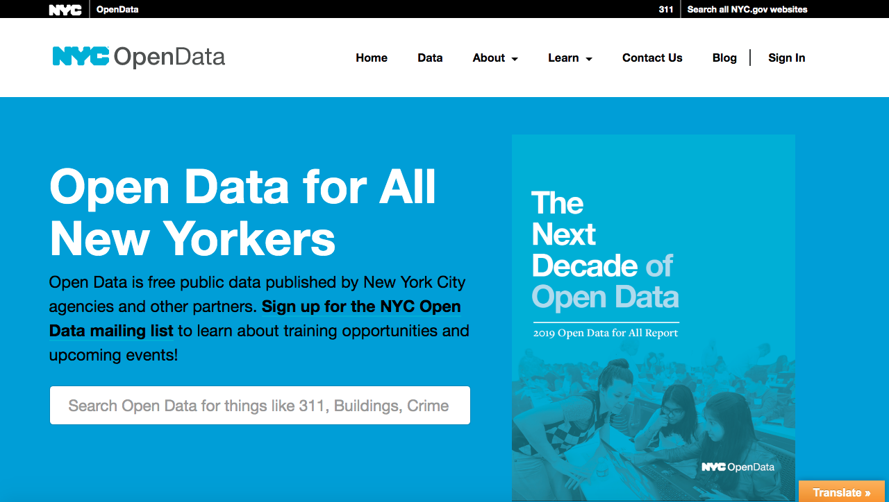
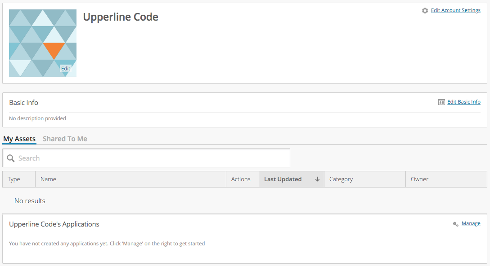

# NYC Open Data

## Learning Objectives

- SWBAT read NYC Open Data developer documentation to construct an API call
- SWBAT read NYC Open Data developer documentation to interpret an API response
- SWBAT request data from NYC Open Data
- SWBAT integrate a NYC Open Data API data into a React component

## Sequence

1. [NYC Open Data APIs](#nyc-open-data-apis)
2. [Getting an App Token](#getting-an-app-token)
3. [Using Our App Token](#using-our-app-token)
4. [Filtering Data from Socrata](#filtering-data-from-socrata)
  1. [More Complex Filtering](#more-complex-filtering)
5. [Getting NYC Open Data into React](#getting-nyc-open-data-into-react)
  1. [Keeping Our App Token Safe](#keeping-our-app-token-safe)
6. [Close](#close)

## Launch

If you haven't yet read through the [React APIs mini-unit](react-apis.md), please do that before beginning this mini-unit.

> Watch this [video walk-through](https://youtu.be/Al4mH79Ka34) to see how NYC Open Data APIs are used with React.

## NYC Open Data APIs



New York City provides free access to numerous data resources on the [NYC Open Data](https://opendata.cityofnewyork.us/) website. There you can [search for datasets](https://opendata.cityofnewyork.us/data/) of city-related data, including 311 calls, restaurant inspection results, geographic datasets, and much much more.

> Because NYC Open Data is coming from a variety of city departments, there's some variability in the quality, utility, and completeness of the data.

The best way to learn how to use the data at NYC Open Data is to dive in, find the API developer documentation, and begin to get some data.

Let's say we're interested in NYC Film Permits, and we find the dataset below:


Clicking on the title leads to a page with more information about the dataset.

There we can see how many rows are in the dataset (62.6K), how many columns it has (14), how often it's updated (daily), how many people have downloaded it (over 8,100), etc.


At this point, if we weren't sure whether this dataset is useful to us, we could click on the "View Data" button where we can begin to get a sense of what data is in the Film Permits dataset. There, you can view the data in a big table (like in Excel or Google Sheets) or one record at a time:


The dataset has over 62,600 records, and that many records is too cumbersome to load into our app directly! We'll need to use an API.

To get to the API version of the dataset: from the information page, we can click on the "API" button (a few over from the "View Data" button). That will show a modal window with information about the Socrata Open Data API (SODA), including links to the [API documentation](https://dev.socrata.com/foundry/data.cityofnewyork.us/tg4x-b46p), the [Socrata portal homepage](https://dev.socrata.com/), and the raw API data, e.g. [https://data.cityofnewyork.us/resource/tg4x-b46p.json](https://data.cityofnewyork.us/resource/tg4x-b46p.json).


## Getting an App Token

Although it may seem like we're good to go now that we know the endpoint for the dataset (the JSON file linked above), Socrata puts a limit on how many times we can access that data without an Application Token. That means we need to [register an Application Token](https://dev.socrata.com/register) (and also create an Account on Socrata):

1. Sign up for a Socrata Account here: [opendata.socrata.com/signup](https://opendata.socrata.com/signup)

2. If you're not directed to the Developer Settings, from the bottom of your profile page, tap the "Manage" link in the top-right corner of your "Applications" list.


3. Tap the "Create New App Token" button, fill in the required information about the app/dataset you're using, and then tap "Save".


4. You'll see your new App Token in the list below the button:


> Note: you get a public and a private App Token - keep the secret token secure and don't share it with others (or in a github repository). Although we won't be using it here, there are other APIs for which you may need to use the secret token to access data.

## Using Our App Token

Now that we have an App Token, we can start to make requests of the API!

According to the [Socrata documentation](https://dev.socrata.com/docs/app-tokens.html), we can append the variable `$$app_token` to the endpoint along with our App Token in order to make the request:

#### Request

```javascript
https://data.cityofnewyork.us/resource/tg4x-b46p.json?$$app_token=TNxXJT9OVmO6FDIhzqXYaEKJ
```

#### JSON Response

```javascript
[{
    "eventid": "507027",
    "eventtype": "Shooting Permit",
    "startdatetime": "2019-09-06T06:00:00.000",
    "enddatetime": "2019-09-06T22:00:00.000",
    "enteredon": "2019-09-05T14:02:05.000",
    "eventagency": "Mayor's Office of Film, Theatre & Broadcasting",
    "parkingheld": "PROVOST STREET between FREEMAN STREET and GREEN STREET,  PROVOST STREET between GREEN STREET and HURON STREET,  PROVOST STREET between GREEN STREET and FREEMAN STREET",
    "borough": "Brooklyn",
    "communityboard_s": "1",
    "policeprecinct_s": "94",
    "category": "Television",
    "subcategoryname": "Cable-episodic",
    "country": "United States of America",
    "zipcode_s": "11222"
  },
  {
    "eventid": "506980",
    "eventtype": "Shooting Permit",
    "startdatetime": "2019-09-06T10:00:00.000",
    "enddatetime": "2019-09-07T04:00:00.000",
    "enteredon": "2019-09-05T10:38:20.000",
    "eventagency": "Mayor's Office of Film, Theatre & Broadcasting",
    "parkingheld": "KINGSLAND AVENUE between GREENPOINT AVENUE and NORMAN AVENUE,  MONITOR STREET between GREENPOINT AVENUE and NORMAN AVENUE",
    "borough": "Brooklyn",
    "communityboard_s": "1",
    "policeprecinct_s": "114, 94",
    "category": "Television",
    "subcategoryname": "Episodic series",
    "country": "United States of America",
    "zipcode_s": "11105, 11222"
  },
  {
    "eventid": "506958",
    "eventtype": "Shooting Permit",
    "startdatetime": "2019-09-06T07:00:00.000",
    "enddatetime": "2019-09-06T21:00:00.000",
    "enteredon": "2019-09-05T09:39:17.000",
    "eventagency": "Mayor's Office of Film, Theatre & Broadcasting",
    "parkingheld": "DIAMOND STREET between MESEROLE AVENUE and CALYER STREET,  JEWEL STREET between MESEROLE AVENUE and CALYER STREET,  CALYER STREET between DIAMOND STREET and JEWEL STREET,  MESEROLE AVENUE between DIAMOND STREET and JEWEL STREET",
    "borough": "Brooklyn",
    "communityboard_s": "1",
    "policeprecinct_s": "94",
    "category": "Television",
    "subcategoryname": "Episodic series",
    "country": "United States of America",
    "zipcode_s": "11222"
  },
  ...
]
```

**Try using _your_ App Token with the endpoint above to get the raw data.**

> **Note: I've altered the App Token above so you will receive a permissions error if you try to use the token shown. You will know your App Token works because you will get data back from the URL.**

## Filtering Data from Socrata

Socrata includes a simple way to [filter data](https://dev.socrata.com/docs/filtering.html) in API requests: by using column names as parameters.

The NYC Film Permit data has 14 columns, one of which indicates the `borough` in which filming will take place:

```javascript
// 14 fields for each entry in dataset
"eventid"
"eventtype"
"startdatetime"
"enddatetime"
"enteredon"
"eventagency"
"parkingheld"
"borough"
"communityboard_s"
"policeprecinct_s"
"category"
"subcategoryname"
"country"
"zipcode_s"
```

To use the `borough` parameter to filter to only the permits granted in Manhattan, we can append `&borough=Manhattan` at the end of our request URL (which already includes our App Token):

#### Request

```javascript
https://data.cityofnewyork.us/resource/tg4x-b46p.json?$$app_token=TNxXJT9OVmO6FDIhzqXYaEKJ&borough=Manhattan
```

#### JSON Response

```javascript
[{
    "eventid": "506313",
    "eventtype": "Shooting Permit",
    "startdatetime": "2019-09-06T06:00:00.000",
    "enddatetime": "2019-09-06T21:00:00.000",
    "enteredon": "2019-08-30T15:02:36.000",
    "eventagency": "Mayor's Office of Film, Theatre & Broadcasting",
    "parkingheld": "RIVERSIDE DRIVE between WEST   75 STREET and WEST   74 STREET,  RIVERSIDE DRIVE between WEST   75 STREET and WEST   76 STREET",
    "borough": "Manhattan",
    "communityboard_s": "7",
    "policeprecinct_s": "20",
    "category": "Film",
    "subcategoryname": "Short",
    "country": "United States of America",
    "zipcode_s": "10023"
  },
  {
    "eventid": "505834",
    "eventtype": "Theater Load in and Load Outs",
    "startdatetime": "2019-09-06T06:00:00.000",
    "enddatetime": "2019-09-07T23:45:00.000",
    "enteredon": "2019-08-28T11:05:52.000",
    "eventagency": "Mayor's Office of Film, Theatre & Broadcasting",
    "parkingheld": "WEST   43 STREET between BROADWAY and 6 AVENUE",
    "borough": "Manhattan",
    "communityboard_s": "5",
    "policeprecinct_s": "14",
    "category": "Theater",
    "subcategoryname": "Theater",
    "country": "United States of America",
    "zipcode_s": "10036"
  },
  {
    "eventid": "506218",
    "eventtype": "Shooting Permit",
    "startdatetime": "2019-09-06T09:00:00.000",
    "enddatetime": "2019-09-06T23:00:00.000",
    "enteredon": "2019-08-30T09:12:25.000",
    "eventagency": "Mayor's Office of Film, Theatre & Broadcasting",
    "parkingheld": "5 AVENUE between EAST   26 STREET and WEST   25 STREET,  WEST   25 STREET between BROADWAY and 5 AVENUE,  BROADWAY between WEST   26 STREET and WEST   25 STREET,  WEST   27 STREET between BROADWAY and 6 AVENUE",
    "borough": "Manhattan",
    "communityboard_s": "5",
    "policeprecinct_s": "13",
    "category": "WEB",
    "subcategoryname": "Not Applicable",
    "country": "United States of America",
    "zipcode_s": "10001, 10010"
  },
  ...
]
```

**Try using _your_ App Token with this endpoint and parameter/variable to get filtered raw data.**

### More Complex Filtering

What if you wanted to get all of the Film Permits _except_ for the ones in Manhattan?

Socrata has more complex filtering capabilities using [SoQL clauses](https://dev.socrata.com/docs/queries/). We might construct the query above using the `$where` parameter, but in this case the variable is an inequality that indicates how to filter the data, e.g. `$where=(borough!="Manhattan").

#### Request

```javascript
https://data.cityofnewyork.us/resource/tg4x-b46p.json?$$app_token=TNxXJT9OVmO6FDIhzqXYaEKJ&$where=(borough!=%22Manhattan%22)
```
> Note: the parentheses are not necessary, however they're included for readibility.
> Note: `%22` is the HTML character code for `"`.

#### JSON Response

```javascript
[{
    "eventid": "186438",
    "eventtype": "Shooting Permit",
    "startdatetime": "2014-10-30T07:00:00.000",
    "enddatetime": "2014-10-31T02:00:00.000",
    "enteredon": "2014-10-27T12:14:15.000",
    "eventagency": "Mayor's Office of Film, Theatre & Broadcasting",
    "parkingheld": "LAUREL HILL BLVD between REVIEW AVENUE and RUST ST,  REVIEW AVE between VAN DAM STREET and LAUREL HILL BOULEVARD,  59 ROAD between 60 LANE and 61 STREET,  59 ROAD between 60 LANE and 61 STREET,  61 STREET between 59 ROAD and FRESH POND ROAD,  FRESH POND ROAD between 59 AVENUE and 59 DRIVE,  59 DRIVE between FRESH POND ROAD and 63 STREET,  59 DRIVE between FRESH POND ROAD and 64 STREET",
    "borough": "Queens",
    "communityboard_s": "2, 5",
    "policeprecinct_s": "104, 108",
    "category": "Television",
    "subcategoryname": "Episodic series",
    "country": "United States of America",
    "zipcode_s": "11378"
  },
  {
    "eventid": "445255",
    "eventtype": "Shooting Permit",
    "startdatetime": "2018-10-20T07:00:00.000",
    "enddatetime": "2018-10-20T18:00:00.000",
    "enteredon": "2018-10-09T21:34:58.000",
    "eventagency": "Mayor's Office of Film, Theatre & Broadcasting",
    "parkingheld": "JORALEMON STREET between BOERUM PLACE and COURT STREET",
    "borough": "Brooklyn",
    "communityboard_s": "2",
    "policeprecinct_s": "84",
    "category": "Still Photography",
    "subcategoryname": "Not Applicable",
    "country": "United States of America",
    "zipcode_s": "11201"
  },
  {
    "eventid": "43547",
    "eventtype": "Shooting Permit",
    "startdatetime": "2012-01-10T07:00:00.000",
    "enddatetime": "2012-01-10T19:00:00.000",
    "enteredon": "2012-01-04T12:25:37.000",
    "eventagency": "Mayor's Office of Film, Theatre & Broadcasting",
    "parkingheld": "EAGLE STREET between FRANKLIN STREET and WEST STREET,  WEST STREET between EAGLE STREET and FREEMAN STREET,  FREEMAN STREET between WEST STREET and FRANKLIN STREET",
    "borough": "Brooklyn",
    "communityboard_s": "1, 2",
    "policeprecinct_s": "108, 94",
    "category": "Television",
    "subcategoryname": "Episodic series",
    "country": "United States of America",
    "zipcode_s": "11101, 11222"
  },
  ...
]
```

## Getting NYC Open Data into React

Pulling together our React component and our NYC Open Data (Socrata) API request, we end up with a React component that's requesting data from Socrata:

```javascript
import React from 'react';
// any other import statements

class Item extends React.Component {
  constructor(props) {
    super(props);
    this.state = {
      // define state variables here
    }
  }

  componentDidMount = () => {
    let appToken = 'TNxXJT9OVmO6FDIhzqXYaEKJ'; // see below to secure your App Token
    fetch('https://data.cityofnewyork.us/resource/tg4x-b46p.json?$$app_token='+appToken+'&borough=Manhattan')
      .then(response => response.json()) // convert response to JSON
      .then(data => {
        // code to execute once data is defined
      })
      .catch(e => {
        alert(e);
      })
  }
  
  render() {
    return (
      // render component HTML here
    );
  }
}
   
export default Item;
```

At this point, it's worth re-recognizing that the API's response, the variable `response` above, is an array of objects. We already know how to use `.map()` and other JavaScript functions on an array of objects to manipulate and return HTML in a React component! Yay!

### Keeping Our App Token Safe

Although the Socrata App Token is generally ok to send "in the clear" (without encrypting it or hiding it) when making an API request, there are some credentials that you'll want to keep safe from prying eyes. For those, you'll want to create a special file to store environment variables. This file is called `.env`, and in React there are a few things to note when creating and using an `.env` file:
- All React environment variables must start with `REACT_APP_` in order to be recognized by the App: e.g. `REACT_APP_SOCRATA_TOKEN`.
- The variable is stored in `.env` along with its value, but the .env file is part of your `.gitignore` file so it isn't committed to github:
```
REACT_APP_SOCRATA_TOKEN = TNxXJT9OVmO6FDIhzqXYaEKJ
```
- The environment variable can be used in your code by prepending `process.env.` to the name of the variable and wrapping it in `{}`: e.g. `{process.env.REACT_APP_SOCRATA_TOKEN}
- If you change the environment variables, you will need to restart the server to implement the new environment variables.

> Read more about using [Custom Environment Variables in the React Documentation](https://create-react-app.dev/docs/adding-custom-environment-variables/).

## Close

Successfully using APIs to get data is all about knowing the data you need, finding a source for that data, and being able to access it via a URL.

At this point, we encourage you to explore the [NYC Open Data Portal](https://opendata.cityofnewyork.us/) for data that you find interesting and would like use in a creative and meaningful way.
