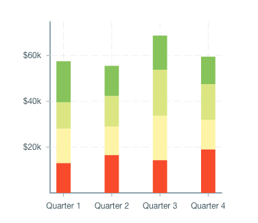
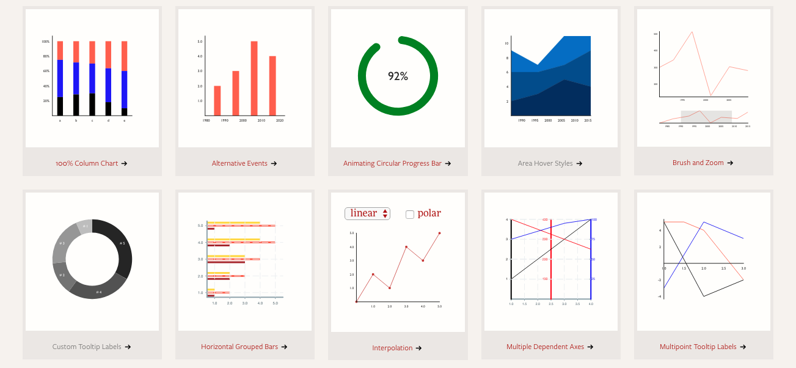
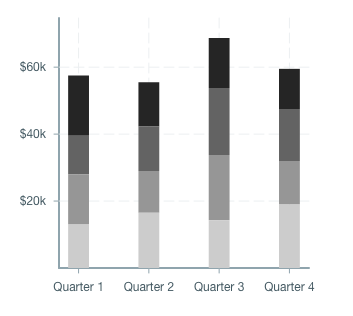

# Visualizing Data with Victory

## Learning Objectives

- SWBAT consult developer documentation to get started with a new library
- SWBAT reference developer documentation to troubleshoot
- SWBAT use Victory react.js components to visualize data

## Sequence

1. [Launch](#launch)
2. [Getting Started with Victory](#getting-started-with-victory)
3. [More Victory Examples](#more-victory-examples)
   1. [Optional Exercise](#optional-exercise)
4. [Visual Design](#visual-design)
   1. [Building a Beautiful Visualization: Color](#building-a-beautiful-visualization-color)
   2. [Building a Beautiful Visualization: Text & Fonts](#building-a-beautiful-visualization-text--fonts)
5. [Close](#close)

## Launch

What do you do when you want to include data visualizations in your React application? Maybe you'd google "react.js data visualization"? If you were to google that, hiding on the second page of results is a [React-based data visualization library called Victory](https://formidable.com/open-source/victory/).

Explore their [home page](https://formidable.com/open-source/victory/) and see what you think.


Check out the code for ["Exemplar Project 1: NYC Water"](https://github.com/upperlinecode/nyc_open_data_water_project). Explore the code in the repository and see if you can determine how Victory was used to visualize the data in that app.

- How many data visualization components are there?
- What is the filename of the New York City Population data?
- Which Victory library components are imported for the Water Consumption visualization?

## Getting Started with Victory

> Watch this [video walk-through](https://youtu.be/YJEeV3NpslU) to help you get started with Victory.

By now you're familiar with _why_ you'd want to [visualize data](./data/visualization.md), but doing it will draw upon not just our ability to code but also our skills in visual design. Once you know how to make a visualization with Victory, then we'll discuss how to make a _good_ visualization with Victory.

Although there are quite a few other data visualization libraries out there (e.g. [d3.js](https://d3js.org/)), we've chosen to explore Victory because it is a natural fit when we're building with React.

As with any new library or software, the best place to get started learning about Victory is the developer documentation, specifically Victory's [Getting Started Guide](https://formidable.com/open-source/victory/docs).

Open the [Getting Started Guide](https://formidable.com/open-source/victory/docs) and take a quick look through the documentation; this is how the team at Victory suggest you begin to learn how to use Victory. Don't worry if it seems like there's a lot there; we're still going to help you make sense of it all.

> Note: Instead of reproducing the Victory Getting Started Guide, you will practice using the developer documentation to figure out how to work with Victory. This is how real developers would approach and implement a library like this.

Let's consult the [Victory Getting Started Guide](https://formidable.com/open-source/victory/docs) in order to build the data visualization below:



1. ([Guide Step 1](https://formidable.com/open-source/victory/docs/#1-set-up-a-basic-react-project)) Initialize a new React project:
   1. Run `git clone https://github.com/FormidableLabs/victory-tutorial`.
   2. `cd` into the `victory-tutorial` folder.
   3. Overwrite the contents of the `client.js` file with what's in the guide.
   4. Run `npm install` and `npm start` to install the dependencies and spin up the basic project.

2. ([Guide Step 2](https://formidable.com/open-source/victory/docs/#2-add-victory)) Add Victory via `npm install victory` and `import` the whole library in your `client.js` file. Check the [documentation](https://formidable.com/open-source/victory/docs/#2-add-victory) to see how they suggest doing this.

3. ([Guide Step 3](https://formidable.com/open-source/victory/docs/#3-add-your-data)) Add the data below to your `client.js` file after the `import` statements and before your component definition:

```javascript
const earningsData = [
  {quarter: 1, earnings: 13000},
  {quarter: 2, earnings: 16500},
  {quarter: 3, earnings: 14250},
  {quarter: 4, earnings: 19000}
];
```

4. ([Guide Step 4a](https://formidable.com/open-source/victory/docs/#4-add-your-first-victory-component)) Import the `VictoryBar` component from the Victory library by updating the import function:

```javascript
// Before: import everything from Victory
import * from 'victory';

// After: just import the VictoryBar component
import { VictoryBar } from 'victory';
```

Now add the `<VictoryBar />` component into the `return` statement of the main component. But wait, it doesn't refer to the data yet...

5. (Guide Step 4b) Add accessor props to the `<VictoryBar />` component, including for `data`, `x`, and `y` values.

```javascript
// Before: a lonely <VictoryBar /> component with no data
<VictoryBar />

// After: a populated <VictoryBar /> component with props
<VictoryBar
  data={earningsData} // what's stored in const earningsData
  x="quarter" // which field to make the x values
  y="earnings" // which field to make the y values
/>
```

6. ([Guide Step 5](https://formidable.com/open-source/victory/docs/#5-add-a-chart-wrapper)) Next, wrap the `<VictoryBar />` component with a `<VictoryChart></VictoryChart>` component which enables the bar chart to have axes. Don't forget to import `VictoryChart`, too:

```javascript
// update the Victory import statement
import { VictoryBar, VictoryChart } from 'victory';

// wrap the VictoryBar component with the VictoryChart component
<VictoryChart>
  <VictoryBar
    data={earningsData} // what's stored in const earningsData
    x="quarter" // which field to make the x values
    y="earnings" // which field to make the y values
  />
</VictoryChart>
```

7. ([Guide Step 6](https://formidable.com/open-source/victory/docs/#6-customize-the-axes)) Import the `VictoryAxis` component and add two of them inside the `<VictoryChart />` component. Set the props for each: the x-axis `<VictoryAxis />` component should have `tickValues` and `tickFormatting` props, but the y-axis `<VictoryAxis />` component only has `tickFormatting` and a `dependentAxis` parameter that indicates that its values and range aren't rigidly set (because they depend on the data).

You can also add `domainPadding` to the `<VictoryChart />` component to better arrange the y-axis.

```javascript
<VictoryChart
  domainPadding={20}
>
  <VictoryAxis
    tickValues={[1, 2, 3, 4]}
    tickFormat={["Quarter 1", "Quarter 2", "Quarter 3", "Quarter 4"]}
  />
  <VictoryAxis
    dependentAxis
    tickFormat={(x) => (`$${x / 1000}k`)}
  />
  <VictoryBar
    data={data}
    x="quarter"
    y="earnings"
  />
</VictoryChart>
```

8. ([Guide Step 7](https://formidable.com/open-source/victory/docs/#7-add-a-theme)) Import and add the `VictoryTheme` component, and add a `theme` prop to the `<VictoryChart />` component where the value is `{VictoryTheme.material}`. This default `material` theme will add pre-set colors and spacing to the chart.

```javascript
<VictoryChart
  theme={VictoryTheme.material}
  domainPadding={20}
>
```

9. ([Guide Step 8](https://formidable.com/open-source/victory/docs/#8-stack-multiple-bar-charts)) Import and add the `VictoryStack` component, and update your component according to the [Getting Started Guide](https://formidable.com/open-source/victory/docs/#8-stack-multiple-bar-charts) to build the stacked bar chart shown above.

The Getting Started Guide also shows a [Step 9](https://formidable.com/open-source/victory/docs/#9-override-themes-color-scale) which overrides the default theme colors using a `colorScale` prop on the `<VictoryStack />` component; we'll return to this later when we discuss visual design.

## More Victory Examples

In addition to the stacked bar graph component you just saw, there are examples of another 20+ visualizations you could implement in Victory's [Visualization Gallery](https://formidable.com/open-source/victory/gallery/).

> These examples are constructed from the 14 Victory components (as per the Victory Documentation section "Charts"), several containers, and various effects. Each item is documented in case you'd like to use that type of graph.



Click into one of the visualizations and explore the code that's used to produce it. Most importantly, look at the data and the structure of the data that is ingested.

For instance, the pie (donut) visualization below is made up of a `<VictoryPie />` component with a `<VictoryLabel />` component for the middle text. The `<VictoryPie />` component has several props, but the two that matter most for how it looks are the `innerRadius={68}` prop which turns the pie into a donut, and the `labelRadius={100}` which sets the placement of the series labels. The `style` prop is also used to change the color of the labels so they're white instead of the default color.

```javascript
<VictoryPie
  standalone={false}
  width={400}
  height={400}
  data={[
    { x: 1, y: 120 }, { x: 2, y: 150 }, { x: 3, y: 75 }
  ]}
  innerRadius={68} labelRadius={100}
  style={{ labels: { fontSize: 20, fill: "white" } }}
/>
<VictoryLabel
  textAnchor="middle"
  style={{ fontSize: 20 }}
  x={200}
  y={200}
  text="Pie!"
/>
```

The `data` for the `<VictoryPie />` is a series of points with a `x` and `y` value, where the `x` value is the series name (or category), and the `y` value is related to how much of the pie it will take up. Victory does the hard work of figuring out the math for how big each slice of the pie should be depending on the `y` values so the whole pie adds up to 100%.


### Optional Exercise

As you begin to use Victory to visualize data, you'll realize there are many different visualizations you could use to display the same data. The choice of which visualization is best will depend on the message you want to communicate, but there will not be one "correct" visualization to use. The following exercise is meant to simulate how you can go about finding many visualizations for the same data.

Most of the data used by Victory comes in the form of `x`, `y` pairs. Imagine you've been given the example data below which represents the number of boxes of Girl Scout cookies sold by 5 members of Girl Scout Troop 314 over the last three years. 

Which different graph(s) do you think could be used to display some or all of the data? What story would each type of graph tell? Without coding a solution, try to draw what you think the visualization(s) would look like.

```javascript
const sales2017 = {[
  { x: 1, y: 24 },
  { x: 2, y: 31 },
  { x: 3, y: 55 },
  { x: 4, y: 42 },
  { x: 5, y: 70 }
]}

const sales2018 = {[
  { x: 1, y: 32 },
  { x: 2, y: 50 },
  { x: 3, y: 49 },
  { x: 4, y: 61 },
  { x: 5, y: 39 }
]}

const sales2019 = {[
  { x: 1, y: 42 },
  { x: 2, y: 72 },
  { x: 3, y: 39 },
  { x: 4, y: 42 },
  { x: 5, y: 58 }
]}
```

Now you're ready to get creative thinking about how different visualizations can be used to represent different kinds of data.

## Visual Design

### Building a Beautiful Visualization: Color

Luckily, Victory comes with several built-in color palettes that make our lives a lot easier when we're trying to choose colors for our visualizations. Buried [deep in the documentation](https://formidable.com/open-source/victory/docs/victory-stack#colorscale) is a description of how to use the `colorScale` prop to quickly colorize a component like a `<VictoryStack />`, `<VictoryPie />`, or `<VictoryGroup />`:

> The colorScale prop is an optional prop that defines a color scale to be applied to the children of the component. This prop should be given as an array of CSS colors, or as a string corresponding to one of the built in color scales: "grayscale", "qualitative", "heatmap", "warm", "cool", "red", "green", "blue".

|  |  |  |  |
|:---:|:---:|:---:|:---:|
| "warm" | "cool" | "qualitative" | "grayscale" |

Ask any designer, and they'll tell you that color is a critical player in visual communication because color brings with it meaning based in societal contexts. Color theory is a whole field of study on its own, and although we can't say everything about it here, it's worth mentioning a few key ideas.

1. In the West, red things tend to be hot or have a negative connotation; blue things tend to be cold; green things tend to have a positive connotation.
2. Less dense (or lighter) colors are used to represent lower concentrations, while dense (or dark) colors are used to represent high concentrations.
3. Humans are notoriously bad at deciphering data encoded as variations in color, so it's best to use color as a signifier, but not a source of comparison (i.e. "Which is bluer?" is a tough question for us to answer).
4. Some people are color-blind, so make sure to choose colors that are different in color, tint, and shade and don't rely on color differences to get your point across.

When choosing colors and color palettes, you want to think about the message you're trying to communicate with the data. When not used properly, color can confuse a data visualization more than it can help it. The best way to avoid this confusion is to show the visualization to someone else and see whether they understand the meaning of the colors. If not, you may want to change them.

### Building a Beautiful Visualization: Text & Fonts

In addition to color, one of the biggest areas in which a visualization can be improved is by the addition of text. However, sometimes text can also overwhelm a visualization if there are too many labels, labels that are too long, or labels that take up too much space or attention in the visualization.

Victory has some built-in default parameters for styling of labels (axis labels and data labels), but sometimes you need to tweak those defaults. To do so, you can edit [Victory's default theme](https://formidable.com/open-source/victory/guides/themes) or [build your own theme](https://formidable.com/open-source/victory/docs/victory-theme).

Explore the [Live Code](https://formidable.com/open-source/victory/guides/themes) in Victory's documentation to see how you could implement a theme that works well for the visualizations you make.

## Close

Using a library like Victory makes it very easy to quickly spin up data visualizations. Equally important, the ability to source data - including live or real-time data - and visualize it can be a critical factor when relying on data and data visualizations to make good decisions.

And although we jumped into using Victory for data visualization with React, it's worth noting that it's sometimes easier to ideate a data visualization with pencil and paper before ever touching a line of code. This way you can ensure that the time you spend corraling data leads to a worthwhile end.
